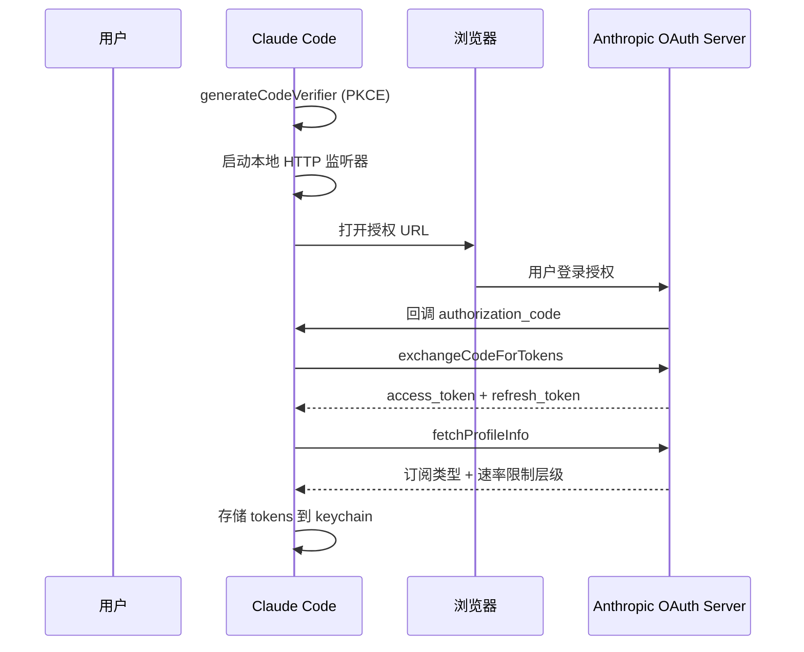

# 认证与 OAuth 系统 - 深度分析

## 6.1 功能概述

认证系统管理 Claude Code 与 Anthropic API 的身份验证，支持三种认证方式：OAuth 2.0 PKCE 流程（claude.ai 订阅用户）、API Key 直接认证（Console 用户）和第三方提供商认证（AWS Bedrock/Google Vertex/Azure Foundry）。OAuth 流程包含浏览器自动跳转和手动粘贴两种模式，支持 token 刷新、多组织切换和 keychain 安全存储。

## 6.2 核心流程图



## 6.3 关键数据结构

```typescript
type OAuthTokens = {
  accessToken: string
  refreshToken: string
  expiresAt: number              // 过期时间戳
  scopes: string[]               // 授权范围
  subscriptionType: SubscriptionType | null  // Pro/Max/Team/Enterprise
  rateLimitTier: RateLimitTier | null
  profile?: OAuthProfileResponse
  tokenAccount?: {
    uuid: string
    emailAddress: string
    organizationUuid?: string
  }
}
```

## 6.5 设计决策分析

- PKCE 流程：无需 client_secret，适合 CLI 这种公开客户端
- 双模式授权：自动（浏览器回调）+ 手动（粘贴 code），覆盖无浏览器环境
- Keychain 存储：利用 OS 原生 keychain 安全存储 token，避免明文存储
- 多提供商：通过 `ANTHROPIC_BASE_URL` 和 provider-specific 环境变量支持 Bedrock/Vertex

## 6.7 关键代码位置索引

| 文件 | 关键内容 |
|------|---------|
| `src/services/oauth/index.ts` | OAuthService 类，OAuth 流程入口 |
| `src/services/oauth/client.ts` | OAuth API 客户端（buildAuthUrl、exchangeCodeForTokens） |
| `src/services/oauth/auth-code-listener.ts` | 本地 HTTP 回调监听器 |
| `src/services/oauth/crypto.ts` | PKCE 密码学工具（codeVerifier、codeChallenge） |
| `src/utils/auth.ts` | 认证状态管理、token 存储 |
| `src/utils/secureStorage/` | Keychain 安全存储 |
| `src/services/api/client.ts` | API 客户端认证头配置 |
| `src/cli/handlers/auth.ts` | CLI auth 子命令 |
