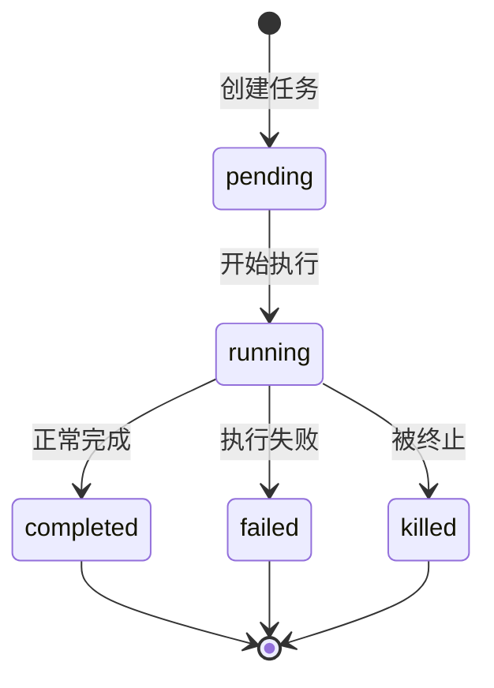

# 后台任务系统 - 深度分析

## 6.1 功能概述

后台任务系统管理 Claude Code 中所有异步执行的任务，包括 Shell 命令（LocalShellTask）、子 Agent（LocalAgentTask）、远程 Agent（RemoteAgentTask）、进程内 Teammate（InProcessTeammateTask）和 Dream 任务。每个任务有独立的生命周期（pending → running → completed/failed/killed）、输出文件和 abort 控制。任务通过 `TaskCreateTool`/`TaskStopTool` 等工具由模型管理。

## 6.2 核心流程图



## 6.3 关键数据结构

```typescript
type TaskType = 'local_bash' | 'local_agent' | 'remote_agent'
              | 'in_process_teammate' | 'local_workflow' | 'monitor_mcp' | 'dream'

type TaskStatus = 'pending' | 'running' | 'completed' | 'failed' | 'killed'

type TaskStateBase = {
  id: string              // 带前缀的唯一 ID（如 "b1a2b3c4"）
  type: TaskType
  status: TaskStatus
  description: string
  startTime: number
  endTime?: number
  outputFile: string      // 输出文件路径
  outputOffset: number    // 输出读取偏移
}
```

## 6.7 关键代码位置索引

| 文件 | 关键内容 |
|------|---------|
| `src/Task.ts` | Task 接口、TaskType/TaskStatus、ID 生成 |
| `src/tasks.ts` | 任务注册（getAllTasks、getTaskByType） |
| `src/tasks/LocalShellTask/` | Shell 命令任务 |
| `src/tasks/LocalAgentTask/` | 本地 Agent 任务 |
| `src/tasks/RemoteAgentTask/` | 远程 Agent 任务 |
| `src/tasks/InProcessTeammateTask/` | 进程内 Teammate 任务 |
| `src/tasks/DreamTask/` | Dream 任务 |
| `src/tasks/types.ts` | TaskState 类型 |
| `src/tools/TaskCreateTool/` | 任务创建工具 |
| `src/tools/TaskStopTool/` | 任务停止工具 |
