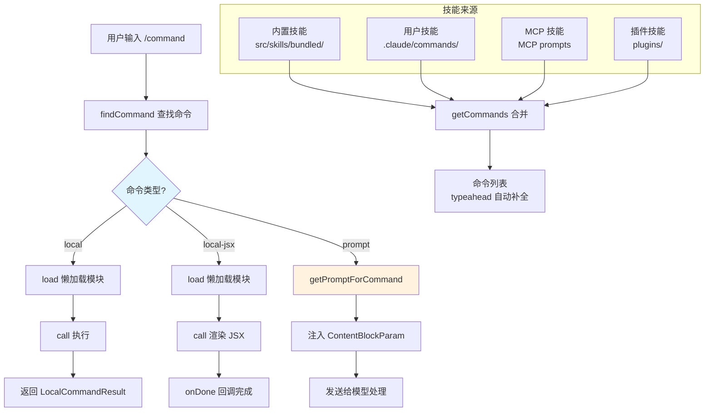

# 命令与技能系统 - 深度分析

## 6.1 功能概述

命令与技能系统是 Claude Code 的扩展框架，管理 80+ 种斜杠命令（如 `/compact`、`/config`、`/resume`）和技能（Skills）。命令分为三类：本地命令（直接执行 JS 逻辑）、本地 JSX 命令（渲染 React UI）和提示命令（注入 prompt 给模型）。技能系统支持内置技能、用户自定义技能（`.claude/commands/`）、MCP 技能和插件技能，通过 `SkillTool` 让模型可以主动调用技能。

## 6.2 核心流程图



## 6.3 核心调用链

```
getCommands(cwd)                               # src/commands.ts:L476
  → getSkills(cwd)                             # src/commands.ts:L353
      → loadSkillsDir()                        # src/skills/loadSkillsDir.ts
      → getBundledSkills()                     # src/skills/bundledSkills.ts
      → getMcpSkillCommands()                  # src/commands.ts:L547
  → 合并内置命令 + 技能命令 + 插件命令

// 模型调用技能
SkillTool.call({ skill_name, args })           # src/tools/SkillTool/
  → findCommand(skill_name, commands)          # 查找命令
  → command.getPromptForCommand(args)          # 获取 prompt
  → 注入消息历史
```

## 6.4 关键数据结构

```typescript
// 命令基础类型
type Command = CommandBase & (PromptCommand | LocalCommand | LocalJSXCommand)

type CommandBase = {
  name: string                    // 命令名（如 "compact"）
  description: string             // 描述
  isEnabled?: () => boolean       // 是否启用
  isHidden?: boolean              // 是否隐藏
  loadedFrom?: 'skills' | 'plugin' | 'mcp' | 'bundled'  // 来源
  kind?: 'workflow'               // 工作流命令标记
}

// 提示命令（注入 prompt 给模型）
type PromptCommand = {
  type: 'prompt'
  source: 'builtin' | 'mcp' | 'plugin' | 'bundled'
  context?: 'inline' | 'fork'    // 内联执行或 fork 子 agent
  getPromptForCommand(args, context): Promise<ContentBlockParam[]>
}
```

## 6.5 设计决策分析

- 懒加载：命令模块通过 `load()` 延迟加载，避免启动时加载所有命令的开销
- 三种命令类型：local（纯逻辑）、local-jsx（需要 UI）、prompt（给模型），覆盖不同交互模式
- SkillTool 桥接：模型通过 SkillTool 调用技能，技能内容作为 prompt 注入，保持工具系统的统一性
- 插件隔离：插件技能通过 `skillRoot` 设置环境变量，hooks 在技能作用域内执行

## 6.7 关键代码位置索引

| 文件 | 关键内容 |
|------|---------|
| `src/commands.ts` | 命令注册、查找、合并逻辑 |
| `src/types/command.ts` | Command 类型定义 |
| `src/commands/` | 80+ 内置命令实现 |
| `src/skills/loadSkillsDir.ts` | 技能目录加载 |
| `src/skills/bundledSkills.ts` | 内置技能注册 |
| `src/skills/mcpSkillBuilders.ts` | MCP 技能构建 |
| `src/tools/SkillTool/` | 技能调用工具 |
| `src/plugins/` | 插件系统 |
