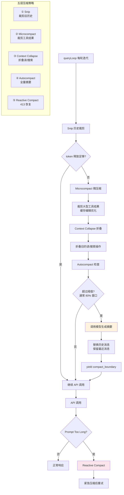

# 上下文压缩系统 - 深度分析

## 6.1 功能概述

上下文压缩系统解决长对话中上下文窗口溢出的核心问题。它实现了五层递进式压缩策略：Snip（历史裁剪）→ Microcompact（工具结果裁剪/缓存编辑）→ Context Collapse（上下文折叠）→ Autocompact（主动全量摘要）→ Reactive Compact（被动 413 恢复）。每层压缩的粒度和成本不同，系统优先使用低成本方式，不够再升级到更激进的压缩。

## 6.2 核心流程图



## 6.3 核心调用链

```
queryLoop()                                    # src/query.ts
  → snipModule.snipCompactIfNeeded()           # ① Snip 裁剪
  → deps.microcompact()                        # ② Microcompact
      → microcompactMessages()                 # src/services/compact/microCompact.ts
          → collectCompactableToolIds()        # 找到可裁剪的工具结果
          → cachedMicrocompactPath()           # 缓存编辑路径
  → contextCollapse.applyCollapsesIfNeeded()   # ③ Context Collapse
  → deps.autocompact()                        # ④ Autocompact
      → autoCompactIfNeeded()                  # src/services/compact/autoCompact.ts
          → shouldAutoCompact()                # 检查是否超过阈值
          → compactConversation()              # src/services/compact/compact.ts
              → streamCompactSummary()         # 调用模型生成摘要
  → [API 调用失败 413]
      → reactiveCompact.tryReactiveCompact()   # ⑤ Reactive Compact
```

## 6.4 关键数据结构

```typescript
// 压缩结果
interface CompactionResult {
  summaryMessages: Message[]           // 摘要消息
  attachments: AttachmentMessage[]     // 附件（文件状态、计划等）
  hookResults: Message[]               // Hook 结果
  preCompactTokenCount: number         // 压缩前 token 数
  postCompactTokenCount: number        // 压缩后 token 数
  truePostCompactTokenCount?: number   // 实际 API 报告的 token 数
  compactionUsage?: Usage              // 压缩调用的 token 用量
}

// 自动压缩追踪
type AutoCompactTracking = {
  compacted: boolean          // 是否已压缩
  turnId: string              // 压缩轮次 ID
  turnCounter: number         // 压缩后的轮次计数
  consecutiveFailures: number // 连续失败次数
}
```

## 6.5 设计决策分析

### 决策 1：五层递进压缩

- 问题：不同场景需要不同粒度的压缩。
- 方案：从最轻量（snip）到最重量（reactive compact）五层递进。
- 原因：轻量压缩保留更多上下文细节；只在必要时才使用重量级压缩。
- Trade-off：五层交互复杂，边界条件多（如压缩后仍超限需要级联到下一层）。

### 决策 2：Autocompact 阈值触发

- 问题：何时触发全量压缩？
- 方案：当 token 数超过模型上下文窗口的 ~80% 时触发。
- 原因：留出 20% 余量给模型响应和工具结果。
- Trade-off：阈值太低浪费上下文空间，太高可能导致 413 错误。

### 决策 3：Reactive Compact 作为最后防线

- 问题：Autocompact 可能因为各种原因未能及时触发。
- 方案：捕获 API 的 413 Prompt Too Long 错误，紧急执行压缩后重试。
- 原因：保证对话不会因为上下文溢出而中断。
- Trade-off：Reactive 路径有额外延迟（压缩 + 重试），且只尝试一次。

## 6.6 错误处理策略

| 场景 | 处理方式 |
|------|---------|
| Autocompact 失败 | 递增 consecutiveFailures，达到上限后停止重试 |
| Reactive compact 失败 | Surface 原始 413 错误给用户 |
| 压缩后仍超限 | 级联到下一层压缩策略 |
| 媒体内容过大 | Reactive compact 裁剪媒体后重试 |

## 6.7 关键代码位置索引

| 文件 | 关键内容 |
|------|---------|
| `src/services/compact/compact.ts` | 核心压缩逻辑 compactConversation |
| `src/services/compact/autoCompact.ts` | 自动压缩触发与阈值计算 |
| `src/services/compact/microCompact.ts` | 微压缩（工具结果裁剪） |
| `src/services/compact/apiMicrocompact.ts` | API 缓存编辑微压缩 |
| `src/services/compact/prompt.ts` | 压缩提示词模板 |
| `src/services/compact/grouping.ts` | 消息分组策略 |
| `src/services/compact/postCompactCleanup.ts` | 压缩后清理 |
| `src/services/compact/sessionMemoryCompact.ts` | 会话记忆压缩 |
