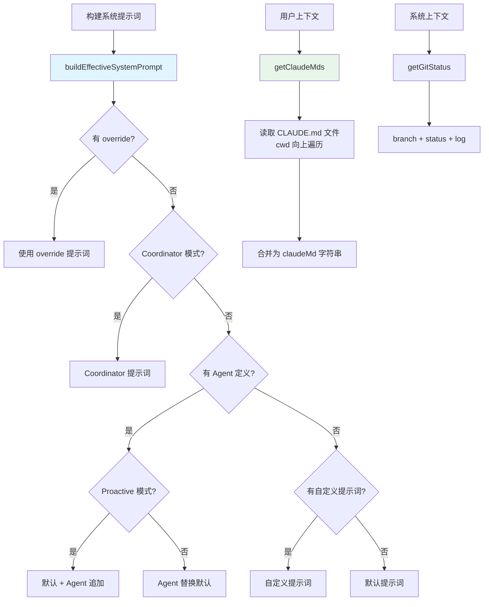

# 上下文与提示词构建 - 深度分析

## 6.1 功能概述

上下文与提示词构建模块负责组装发送给 Claude API 的完整上下文，包括系统提示词（system prompt）、用户上下文（CLAUDE.md 内容、日期）和系统上下文（Git 状态）。系统提示词的构建支持多种优先级来源：默认提示词、自定义提示词、Agent 提示词、Coordinator 提示词和追加提示词，确保模型在每次对话中获得正确的身份和指令。

## 6.2 核心流程图



## 6.3 核心调用链

```
buildEffectiveSystemPrompt()                   # src/utils/systemPrompt.ts
  → 优先级链：override > coordinator > agent > custom > default
  → + appendSystemPrompt

getSystemContext()                             # src/context.ts
  → getGitStatus()                            # Git 分支/状态/日志
  → getSystemPromptInjection()                # 缓存破坏注入

getUserContext()                               # src/context.ts
  → getMemoryFiles()                          # 发现 CLAUDE.md 文件
  → getClaudeMds()                            # 合并内容
  → getLocalISODate()                         # 当前日期
```

## 6.7 关键代码位置索引

| 文件 | 关键内容 |
|------|---------|
| `src/utils/systemPrompt.ts` | buildEffectiveSystemPrompt 提示词组装 |
| `src/context.ts` | getSystemContext、getUserContext、getGitStatus |
| `src/utils/claudemd.ts` | CLAUDE.md 文件发现与加载 |
| `src/utils/systemPromptType.ts` | SystemPrompt 类型定义 |
