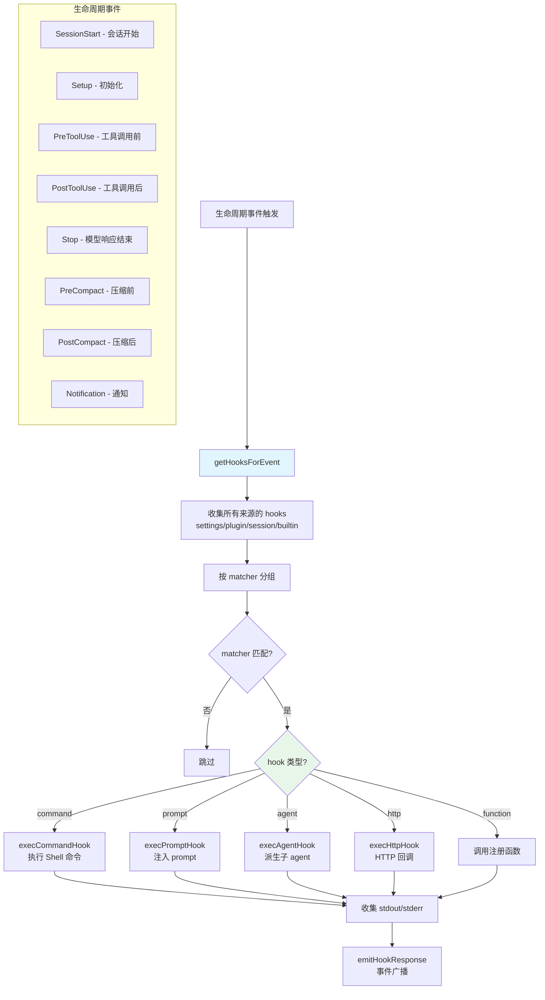

# Hooks 生命周期系统 - 深度分析

## 6.1 功能概述

Hooks 生命周期系统是 Claude Code 的可扩展性核心，允许在关键执行节点注入自定义逻辑。支持五种 hook 类型：command（Shell 命令）、prompt（注入 prompt 给模型）、agent（派生子 agent 执行）、http（HTTP 回调）和 function（内部函数钩子）。Hook 可以在多个生命周期事件上触发：SessionStart、Setup、PreToolUse、PostToolUse、Stop、Notification、PreCompact、PostCompact 等。Hook 配置来自 settings.json（user/project/local）、插件和会话级动态注册。

## 6.2 核心流程图



## 6.3 核心调用链

```
executeHooks(event, context)                   # 触发 hooks 执行
  → getAllHooks(appState)                      # src/utils/hooks/hooksSettings.ts
      → 遍历 settings sources（user/project/local）
      → getSessionHooks()                     # 会话级 hooks
      → plugin hooks                          # 插件 hooks
  → getHooksForEvent(appState, event)          # 按事件过滤
  → 按 matcher 匹配工具名/模式
  → execCommandHook() / execPromptHook() / ...
  → emitHookResponse()                        # src/utils/hooks/hookEvents.ts
```

## 6.4 关键数据结构

```typescript
// Hook 命令类型
type HookCommand =
  | { type: 'command'; command: string; shell?: string; timeout?: number; if?: string }
  | { type: 'prompt'; prompt: string; if?: string }
  | { type: 'agent'; prompt: string; if?: string }
  | { type: 'http'; url: string; if?: string }

// Hook 匹配器
type HookMatcher = {
  matcher?: string          // 工具名/模式匹配（如 "Bash(git *)"）
  hooks: HookCommand[]      // 匹配时执行的 hooks
}

// Hook 来源
type HookSource =
  | 'userSettings' | 'projectSettings' | 'localSettings'
  | 'policySettings' | 'pluginHook' | 'sessionHook' | 'builtinHook'

// Hook 事件
type HookEvent =
  | 'SessionStart' | 'Setup' | 'PreToolUse' | 'PostToolUse'
  | 'Stop' | 'Notification' | 'PreCompact' | 'PostCompact'
  | 'WorktreeCreate' | 'WorktreeDelete'
```

## 6.5 设计决策分析

- Matcher 模式匹配：`if` 条件支持工具名 + 参数模式（如 `Bash(git *)`），由工具的 `preparePermissionMatcher` 实现
- 配置快照：`captureHooksConfigSnapshot()` 在启动时冻结 hooks 配置，防止运行时被恶意修改
- 事件广播：`hookEvents.ts` 提供独立于消息流的事件系统，SDK 可以订阅 hook 执行事件
- SSRF 防护：`ssrfGuard.ts` 对 http 类型 hooks 进行 URL 安全检查

## 6.7 关键代码位置索引

| 文件 | 关键内容 |
|------|---------|
| `src/utils/hooks/hooksSettings.ts` | Hook 配置读取、来源合并、事件过滤 |
| `src/utils/hooks/hookEvents.ts` | Hook 事件广播系统 |
| `src/utils/hooks/hooksConfigManager.ts` | Hook 配置管理与 matcher 分组 |
| `src/utils/hooks/hooksConfigSnapshot.ts` | 配置快照（防篡改） |
| `src/utils/hooks/sessionHooks.ts` | 会话级动态 hook 注册 |
| `src/utils/hooks/execPromptHook.ts` | Prompt 类型 hook 执行 |
| `src/utils/hooks/execAgentHook.ts` | Agent 类型 hook 执行 |
| `src/utils/hooks/execHttpHook.ts` | HTTP 类型 hook 执行 |
| `src/utils/hooks/postSamplingHooks.ts` | 模型响应后 hooks |
| `src/utils/hooks/ssrfGuard.ts` | SSRF 防护 |
| `src/types/hooks.ts` | Hook 类型定义 |
