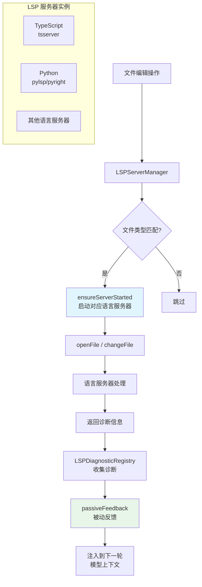

# LSP 集成 - 深度分析

## 6.1 功能概述

LSP（Language Server Protocol）集成模块为 Claude Code 提供代码智能能力，通过连接语言服务器获取诊断信息（错误/警告）、代码补全和符号信息。`LSPServerManager` 管理多个语言服务器实例的生命周期，根据文件类型自动选择对应的服务器。诊断信息通过 `LSPDiagnosticRegistry` 收集，并作为被动反馈（passive feedback）注入到模型上下文中，帮助模型在编辑代码后自动发现和修复问题。

## 6.2 核心流程图



## 6.3 核心调用链

```
FileEditTool.call() / FileWriteTool.call()     # 文件编辑触发
  → LSPServerManager.changeFile(path, content) # 通知 LSP 文件变更
      → LSPServerInstance.didChange()          # LSP 协议 textDocument/didChange
  → LSPDiagnosticRegistry.getDiagnostics()     # 收集诊断
  → passiveFeedback()                          # src/services/lsp/passiveFeedback.ts
      → 格式化诊断为附件消息
      → 注入到 query 循环的 attachments
```

## 6.4 关键数据结构

```typescript
// LSP 服务器管理器接口
interface LSPServerManager {
  initialize(): Promise<void>
  shutdown(): Promise<void>
  getServerForFile(filePath: string): LSPServerInstance | undefined
  ensureServerStarted(filePath: string): Promise<LSPServerInstance | undefined>
  openFile(filePath: string, content: string): Promise<void>
  changeFile(filePath: string, content: string): Promise<void>
  saveFile(filePath: string): Promise<void>
  closeFile(filePath: string): Promise<void>
  getAllServers(): Map<string, LSPServerInstance>
}
```

## 6.5 设计决策分析

- 按需启动：语言服务器只在对应文件类型被编辑时才启动，避免不必要的资源消耗
- 被动反馈：诊断信息作为"被动反馈"注入，模型看到错误后可以自动修复，无需用户干预
- 插件配置：LSP 服务器通过插件系统配置，用户可以添加自定义语言服务器
- 延迟初始化：LSP 管理器在信任对话框接受后才初始化，防止不受信任的项目执行代码

## 6.7 关键代码位置索引

| 文件 | 关键内容 |
|------|---------|
| `src/services/lsp/manager.ts` | LSP 管理器初始化与全局访问 |
| `src/services/lsp/LSPServerManager.ts` | 服务器管理器接口与实现 |
| `src/services/lsp/LSPServerInstance.ts` | 单个 LSP 服务器实例 |
| `src/services/lsp/LSPClient.ts` | LSP 客户端通信 |
| `src/services/lsp/LSPDiagnosticRegistry.ts` | 诊断信息收集 |
| `src/services/lsp/passiveFeedback.ts` | 被动反馈注入 |
| `src/services/lsp/config.ts` | LSP 配置 |
| `src/tools/LSPTool/` | LSP 工具（直接调用 LSP 能力） |
