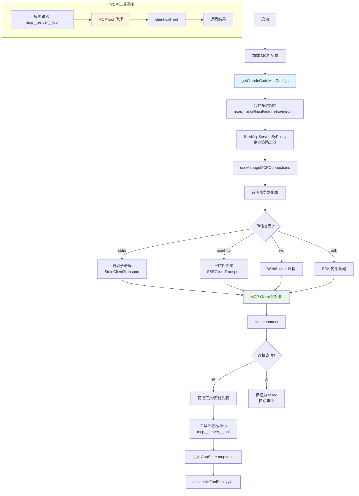

# MCP 集成 - 深度分析

## 6.1 功能概述

MCP（Model Context Protocol）集成模块使 Claude Code 能够连接外部 MCP 服务器，将其提供的工具、资源和提示词无缝融入 AI 对话循环。它支持多种传输协议（stdio/SSE/HTTP/WebSocket/SDK），管理服务器的生命周期（连接/重连/断开），并将 MCP 工具动态注册为 Claude 可调用的工具。配置来源包括用户级、项目级、企业级、CLI 动态注入和 claude.ai 代理等多个层级。

## 6.2 核心流程图



## 6.3 核心调用链

```
getClaudeCodeMcpConfigs(dynamicConfig)         # src/services/mcp/config.ts:L1071
  → getMcpConfigsByScope()                     # 按 scope 收集配置
  → filterMcpServersByPolicy()                 # 企业策略过滤
  → dedupPluginMcpServers()                    # 插件服务器去重

useManageMCPConnections(dynamicConfig)         # src/services/mcp/useManageMCPConnections.ts
  → connectToServer(name, config)              # 连接单个服务器
      → createMCPClient(config)                # src/services/mcp/client.ts
          → StdioClientTransport / SSETransport / ...
      → client.connect()                       # MCP SDK 连接
      → client.listTools()                     # 获取工具列表
      → buildMCPTool(serverName, tool)         # 构建 Tool 对象
  → setAppState(mcp.clients/tools/resources)   # 更新全局状态

// 工具调用路径
MCPTool.call(input)                            # src/tools/MCPTool/
  → client.callTool(toolName, args)            # MCP SDK 调用
  → 处理结果 / 错误 / 超时
```

## 6.4 关键数据结构

```typescript
// MCP 服务器配置（多种传输类型）
type McpServerConfig =
  | McpStdioServerConfig    // { type: 'stdio', command, args, env }
  | McpSSEServerConfig      // { type: 'sse', url, headers, oauth }
  | McpHTTPServerConfig     // { type: 'http', url, headers, oauth }
  | McpWebSocketServerConfig // { type: 'ws', url, headers }
  | McpSdkServerConfig      // { type: 'sdk', name }

// 带作用域的配置
type ScopedMcpServerConfig = McpServerConfig & {
  scope: ConfigScope  // 'local' | 'user' | 'project' | 'dynamic' | 'enterprise' | 'claudeai'
}

// 服务器连接状态
type MCPServerConnection =
  | ConnectedMCPServer   // 已连接：含 client, capabilities, tools
  | FailedMCPServer      // 连接失败：含 error
  | NeedsAuthMCPServer   // 需要认证
  | PendingMCPServer     // 连接中
  | DisabledMCPServer    // 已禁用
```

## 6.5 设计决策分析

### 决策 1：多层配置合并与优先级

- 问题：MCP 配置可能来自多个来源（用户、项目、企业、CLI）。
- 方案：按 scope 优先级合并：enterprise > managed > user > project > local > dynamic > claudeai。
- 原因：企业策略必须不可覆盖；用户配置优先于项目配置（安全考虑）。
- Trade-off：配置来源多，调试时需要理解合并逻辑。

### 决策 2：工具名称标准化

- 问题：不同 MCP 服务器可能有同名工具。
- 方案：MCP 工具名称标准化为 `mcp__<serverName>__<toolName>` 格式。
- 原因：避免命名冲突，同时让模型能区分不同服务器的工具。
- Trade-off：工具名称变长，占用更多 token。

### 决策 3：React Context 管理连接

- 问题：MCP 连接状态需要在 UI 组件间共享。
- 方案：`MCPConnectionManager` 使用 React Context 提供 reconnect/toggle 方法。
- 原因：与 Ink TUI 的 React 架构一致，状态变更自动触发 UI 更新。
- Trade-off：非交互式模式（print）不走 React 路径，需要单独处理。

## 6.6 错误处理策略

| 场景 | 处理方式 |
|------|---------|
| 服务器连接失败 | 标记为 `failed`，自动重连（指数退避） |
| 需要 OAuth 认证 | 标记为 `needs-auth`，触发 OAuth 流程 |
| 工具调用超时 | MCP SDK 层面超时，返回错误 tool_result |
| 服务器崩溃 | 检测到断开，自动重连 |
| 企业策略阻止 | 过滤时移除，输出警告信息 |

## 6.7 关键代码位置索引

| 文件 | 关键内容 |
|------|---------|
| `src/services/mcp/types.ts` | MCP 配置 schema、连接状态类型 |
| `src/services/mcp/config.ts` | 配置加载、合并、策略过滤 |
| `src/services/mcp/client.ts` | MCP 客户端创建 |
| `src/services/mcp/MCPConnectionManager.tsx` | React Context 连接管理 |
| `src/services/mcp/useManageMCPConnections.ts` | 连接生命周期管理 Hook |
| `src/services/mcp/auth.ts` | OAuth 认证流程 |
| `src/services/mcp/elicitationHandler.ts` | URL elicitation 处理 |
| `src/tools/MCPTool/` | MCP 工具代理实现 |
| `src/tools/ListMcpResourcesTool/` | MCP 资源列表工具 |
| `src/tools/ReadMcpResourceTool/` | MCP 资源读取工具 |
