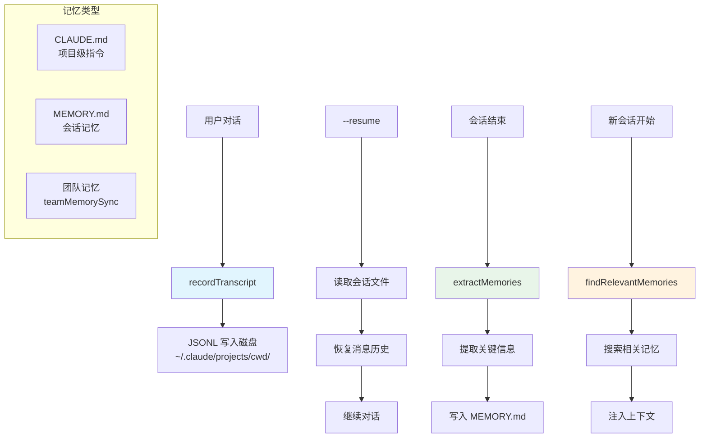

# 记忆与会话持久化 - 深度分析

## 6.1 功能概述

记忆与会话持久化模块负责 Claude Code 的长期记忆和会话恢复能力。会话历史通过 `recordTranscript` 持久化到磁盘（JSONL 格式），支持 `--resume`/`--continue` 恢复。记忆系统（memdir）管理结构化的记忆文件（CLAUDE.md、MEMORY.md），支持自动记忆提取（extractMemories）、相关记忆检索（findRelevantMemories）和团队记忆同步（teamMemorySync）。会话记忆（SessionMemory）在会话结束时自动提取关键信息。

## 6.2 核心流程图



## 6.3 核心调用链

```
recordTranscript(messages)                     # src/utils/sessionStorage.ts
  → enqueueWrite()                            # 异步写入队列
  → JSONL 序列化 → 写入磁盘

findRelevantMemories(messages, context)        # src/memdir/findRelevantMemories.ts
  → memoryScan()                              # src/memdir/memoryScan.ts
  → 相关性评分 → 返回匹配记忆

extractMemories(messages)                      # src/services/extractMemories/
  → 调用模型提取关键信息
  → 写入 memdir 记忆文件
```

## 6.7 关键代码位置索引

| 文件 | 关键内容 |
|------|---------|
| `src/memdir/memdir.ts` | 记忆目录核心操作 |
| `src/memdir/findRelevantMemories.ts` | 相关记忆检索 |
| `src/memdir/memoryScan.ts` | 记忆扫描 |
| `src/memdir/memoryTypes.ts` | 记忆类型定义 |
| `src/memdir/paths.ts` | 记忆文件路径 |
| `src/services/SessionMemory/` | 会话记忆服务 |
| `src/services/extractMemories/` | 记忆提取服务 |
| `src/services/teamMemorySync/` | 团队记忆同步 |
| `src/utils/sessionStorage.ts` | 会话存储（transcript） |
| `src/utils/sessionRestore.ts` | 会话恢复 |
| `src/assistant/sessionHistory.ts` | 助手会话历史 |
