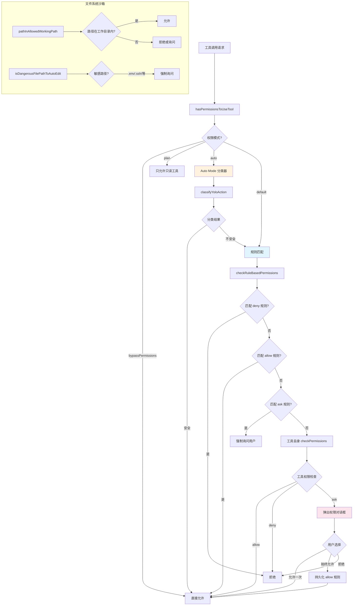

# 权限与安全系统 - 深度分析

## 6.1 功能概述

权限与安全系统是 Claude Code 的安全核心，控制 AI 模型对用户系统的所有操作权限。它实现了多层权限模式（Default/Plan/Auto/Bypass）、基于规则的工具访问控制、文件系统路径沙箱、Shell 命令分类器以及自动模式（Auto Mode）的 AI 分类决策。该系统确保模型在执行文件写入、Shell 命令等潜在危险操作前必须获得适当授权。

## 6.2 核心流程图



## 6.3 核心调用链

```
hasPermissionsToUseTool()                      # src/utils/permissions/permissions.ts:L473
  → getDenyRuleForTool()                       # 检查 deny 规则
  → toolAlwaysAllowedRule()                    # 检查 allow 规则
  → getAskRuleForTool()                        # 检查 ask 规则
  → tool.checkPermissions(input, context)      # 工具自身权限检查
      → checkWritePermissionForTool()          # src/utils/permissions/filesystem.ts:L1205
          → pathInAllowedWorkingPath()         # 路径沙箱检查
          → isDangerousFilePathToAutoEdit()    # 敏感路径检查
          → matchingRuleForInput()             # 路径模式匹配
      → checkReadPermissionForTool()           # src/utils/permissions/filesystem.ts:L1030
  → [Auto Mode 路径]
      → classifyYoloAction()                   # src/utils/permissions/yoloClassifier.ts:L1012
          → buildTranscriptForClassifier()     # 构建分类上下文
          → classifyYoloActionXml()            # 调用分类模型
              → queryHaiku()                   # 使用 Haiku 模型分类
```

## 6.4 关键数据结构

```typescript
// 权限模式
type PermissionMode =
  | 'default'            // 默认模式：按规则 + 用户确认
  | 'plan'               // 计划模式：只允许只读操作
  | 'auto'               // 自动模式：AI 分类器决策
  | 'acceptEdits'        // 接受编辑：自动允许文件编辑
  | 'bypassPermissions'  // 绕过权限：全部允许（沙箱环境）
  | 'dontAsk'            // 不询问：自动允许所有操作

// 权限规则
type PermissionRule = {
  toolName: string           // 工具名称（支持通配符如 "Bash"）
  ruleContent?: string       // 规则内容（如 "git:*" 匹配 git 命令）
  behavior: PermissionBehavior  // 'allow' | 'deny' | 'ask'
  source: PermissionRuleSource  // 规则来源
}

// 规则来源
type PermissionRuleSource =
  | 'user'           // 用户级 ~/.claude/settings.json
  | 'project'        // 项目级 .claude/settings.json
  | 'local'          // 本地级 .claude/settings.local.json
  | 'command'        // CLI --allowedTools 参数
  | 'session'        // 会话内用户选择
  | 'policySettings' // 企业策略

// 权限检查结果
type PermissionResult =
  | { behavior: 'allow' }
  | { behavior: 'deny'; message: string }
  | { behavior: 'ask'; message: string; suggestions?: PermissionSuggestion[] }

// Auto Mode 分类结果
type ClassifierDecision = {
  allowed: boolean
  reason: string
  thinking?: string
  usage: ClassifierUsage
}
```

## 6.5 设计决策分析

### 决策 1：多层权限模式

- 问题：不同使用场景需要不同的安全级别。
- 方案：6 种权限模式，从最严格（plan）到最宽松（bypassPermissions），用户可以随时切换。
- 原因：开发者在不同阶段有不同需求——探索时用 plan，信任后用 auto，沙箱中用 bypass。
- Trade-off：模式越多，用户理解成本越高；模式间的行为差异需要清晰文档。

### 决策 2：规则优先级链

- 问题：多个规则来源可能冲突。
- 方案：deny 规则 > ask 规则 > allow 规则 > 工具默认行为。来源优先级：policy > user > project > local > session > command。
- 原因：安全优先——deny 永远胜出；企业策略不可被项目配置覆盖。
- Trade-off：规则冲突时的行为可能不直观，需要 `permissionExplainer` 帮助用户理解。

### 决策 3：AI 分类器驱动的 Auto Mode

- 问题：频繁的权限弹窗打断开发流程。
- 方案：Auto Mode 使用 Haiku 模型作为分类器，分析工具调用的上下文和意图，自动决定是否允许。
- 原因：比静态规则更智能，能理解命令的语义（如 `rm -rf /` vs `rm temp.txt`）。
- Trade-off：分类器有延迟（~1s）和成本；分类错误可能导致安全问题或误拒。

### 决策 4：文件系统路径沙箱

- 问题：模型可能尝试读写工作目录外的文件。
- 方案：`pathInAllowedWorkingPath()` 检查所有文件操作的路径是否在 cwd 或 `--add-dir` 指定的目录内。
- 原因：最小权限原则——模型只能访问用户明确授权的目录。
- Trade-off：某些合法操作（如编辑全局配置）需要用户额外确认。

## 6.6 错误处理策略

| 场景 | 处理方式 |
|------|---------|
| 权限被拒绝 | 返回拒绝消息给模型，模型可以调整策略或询问用户 |
| 敏感路径写入 | 强制弹出确认对话框，即使在 auto 模式下 |
| 分类器超时/错误 | 降级到 default 模式，要求用户确认 |
| 连续拒绝过多 | `denialTracking` 检测并提示用户切换模式 |
| 路径遍历攻击 | `hasSuspiciousWindowsPathPattern()` 检测 Windows 路径注入 |
| 企业策略冲突 | 企业策略始终优先，不可被本地配置覆盖 |

## 6.7 关键代码位置索引

| 文件 | 关键内容 |
|------|---------|
| `src/utils/permissions/permissions.ts` | 核心权限检查逻辑 `hasPermissionsToUseTool` |
| `src/utils/permissions/PermissionMode.ts` | 权限模式定义与配置 |
| `src/utils/permissions/PermissionRule.ts` | 权限规则类型定义 |
| `src/utils/permissions/filesystem.ts` | 文件系统路径沙箱、读写权限检查 |
| `src/utils/permissions/yoloClassifier.ts` | Auto Mode AI 分类器 |
| `src/utils/permissions/bashClassifier.ts` | Bash 命令分类器（外部版为 stub） |
| `src/utils/permissions/classifierDecision.ts` | 分类器决策类型 |
| `src/utils/permissions/denialTracking.ts` | 拒绝追踪与限制 |
| `src/utils/permissions/permissionsLoader.ts` | 权限规则从磁盘加载 |
| `src/utils/permissions/pathValidation.ts` | 路径验证工具函数 |
| `src/utils/permissions/dangerousPatterns.ts` | 危险模式检测 |
| `src/types/permissions.ts` | 权限相关类型定义（解耦循环依赖） |
