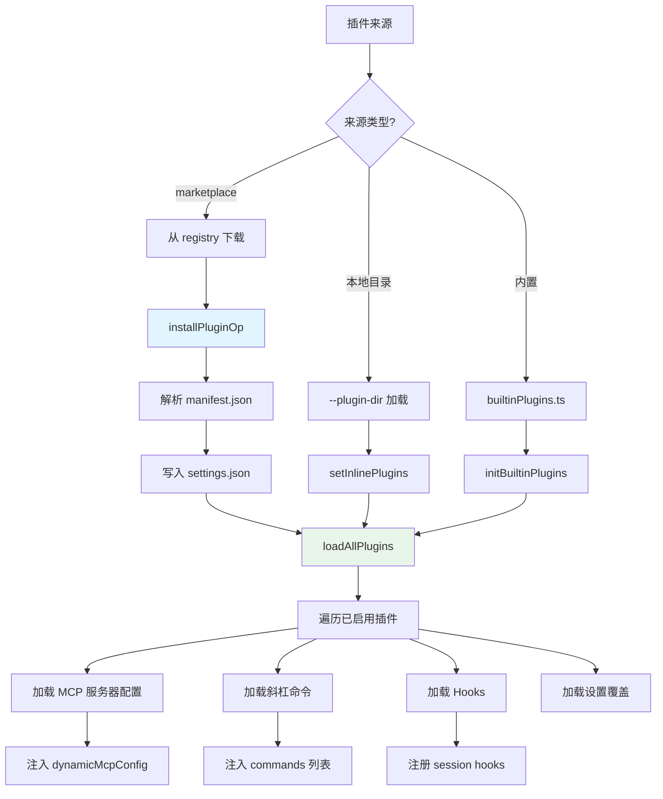

# 插件系统 - 深度分析

## 6.1 功能概述

插件系统允许通过外部包扩展 Claude Code 的能力，包括添加 MCP 服务器、斜杠命令、hooks 和设置。插件通过 DXT（Developer Extension Toolkit）格式打包，支持从 marketplace 安装、本地目录加载和内置插件。插件有完整的生命周期管理（安装/启用/禁用/更新/卸载），支持多作用域（user/project/local），并通过企业策略控制可用性。

## 6.2 核心流程图



## 6.3 关键数据结构

```typescript
// 已加载的插件
type LoadedPlugin = {
  id: string                    // 插件 ID（如 "slack@anthropic"）
  name: string                  // 显示名称
  version: string               // 版本号
  source: string                // 来源标识
  manifest: PluginManifest      // 插件清单
  scope: PluginScope            // 作用域
  enabled: boolean              // 是否启用
  mcpServers?: Record<string, McpServerConfig>  // MCP 服务器
  commands?: Command[]          // 斜杠命令
  hooks?: HooksSettings         // Hooks 配置
}

// 插件错误
type PluginError = {
  pluginId: string
  phase: 'load' | 'init' | 'runtime'
  message: string
  context?: Record<string, unknown>
}
```

## 6.5 设计决策分析

- DXT 格式：标准化的插件打包格式，包含 manifest.json 描述元数据和能力声明
- 多作用域：user 级全局生效，project 级仅当前项目，local 级不提交到 git
- 企业策略：`pluginOnlyPolicy` 可限制只允许特定 marketplace 的插件
- 懒加载：插件的 MCP 服务器在需要时才连接，避免启动延迟

## 6.7 关键代码位置索引

| 文件 | 关键内容 |
|------|---------|
| `src/types/plugin.ts` | LoadedPlugin、PluginManifest 类型定义 |
| `src/services/plugins/pluginOperations.ts` | 安装/卸载/启用/禁用/更新操作 |
| `src/services/plugins/PluginInstallationManager.ts` | 后台安装管理器 |
| `src/services/plugins/pluginCliCommands.ts` | 插件 CLI 命令 |
| `src/plugins/builtinPlugins.ts` | 内置插件注册 |
| `src/utils/plugins/` | 插件工具函数 |
| `src/utils/dxt/` | DXT 格式解析 |
