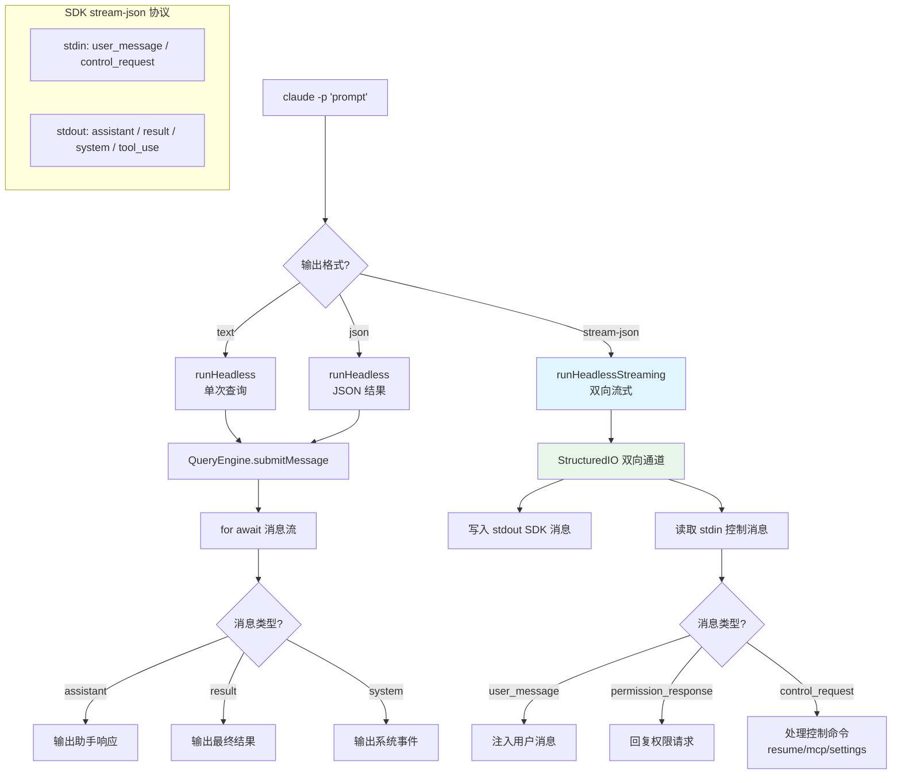

# 非交互式模式（Print/SDK） - 深度分析

## 6.1 功能概述

非交互式模式是 Claude Code 的 headless 执行路径，通过 `-p`/`--print` 标志或 SDK URL 触发。与 REPL 交互模式不同，它不渲染 Ink TUI，而是通过 stdout 输出结果（支持 text/json/stream-json 三种格式）。`print.ts` 是一个 5000+ 行的核心文件，管理 SDK 控制协议（stream-json 双向通信）、权限提示工具（permission-prompt-tool）、MCP 服务器生命周期、会话恢复、命令队列消费等。它是 SDK 集成（TypeScript/Python SDK）、CI/CD 管道和远程会话（CCR）的基础。

## 6.2 核心流程图



## 6.3 核心调用链

```
main.tsx action handler                        # src/main.tsx
  → isNonInteractiveSession = true
  → runHeadless() / runHeadlessStreaming()      # src/cli/print.ts

runHeadless()                                  # print.ts:L455
  → QueryEngine 创建
  → engine.submitMessage(prompt)
  → for await (message of engine)
      → writeToStdout(format(message))
  → 输出 result

runHeadlessStreaming()                         # print.ts:L976
  → StructuredIO 创建                         # src/cli/structuredIO.ts
  → 双向消息循环
      → stdin → processLine() → 路由控制消息
      → QueryEngine → stdout → SDK 消息
  → handleInitializeRequest()                  # 处理 SDK 初始化
  → reconcileMcpServers()                      # MCP 服务器协调
```

## 6.4 关键数据结构

```typescript
// SDK 控制请求（stdin → Claude Code）
type SDKControlRequest =
  | { type: 'user_message'; content: string }
  | { type: 'permission_response'; tool_use_id: string; allowed: boolean }
  | { type: 'resume'; session_id: string }
  | { type: 'mcp_set_servers'; servers: Record<string, McpServerConfig> }
  | { type: 'set_permission_mode'; mode: PermissionMode }
  // ... 更多控制命令

// SDK 输出消息（Claude Code → stdout）
type StdoutMessage =
  | SDKAssistantMessage
  | SDKResultMessage
  | SDKSystemMessage
  | SDKUserMessageReplay
  | SDKStreamEvent
  | SDKToolUseSummaryMessage
```

## 6.5 设计决策分析

- StructuredIO 双向通道：stdin/stdout 上的 NDJSON 协议，支持 SDK 的异步控制（权限回复、MCP 配置变更等）
- Permission Prompt Tool：非交互式模式下通过 MCP 工具代理权限提示，SDK 客户端可以自定义权限 UI
- 三种输出格式：text（简单管道）、json（单次结果）、stream-json（实时流式），覆盖不同集成场景
- 会话恢复：`--resume` 在 headless 模式下加载历史消息，支持 CI/CD 中的多轮对话

## 6.6 错误处理策略

| 场景 | 处理方式 |
|------|---------|
| stdin 关闭 | 优雅退出，flush 未完成的输出 |
| API 错误 | 通过 result.subtype 区分（error_during_execution/error_max_turns 等） |
| MCP 服务器连接失败 | 重试后标记为 failed，不阻塞主查询 |
| 权限请求超时 | SDK 模式下等待 StructuredIO 回复；无 SDK 时自动拒绝 |

## 6.7 关键代码位置索引

| 文件 | 关键内容 |
|------|---------|
| `src/cli/print.ts` | 非交互式模式核心（runHeadless/runHeadlessStreaming） |
| `src/cli/structuredIO.ts` | StructuredIO 双向 NDJSON 通道 |
| `src/cli/remoteIO.ts` | 远程 IO 适配 |
| `src/cli/ndjsonSafeStringify.ts` | NDJSON 安全序列化 |
| `src/cli/transports/` | SSE/WebSocket/HybridTransport 传输层 |
| `src/QueryEngine.ts` | 查询引擎（headless 模式入口） |
| `src/entrypoints/agentSdkTypes.ts` | SDK 类型定义 |
| `src/entrypoints/sdk/` | SDK schema 定义 |
