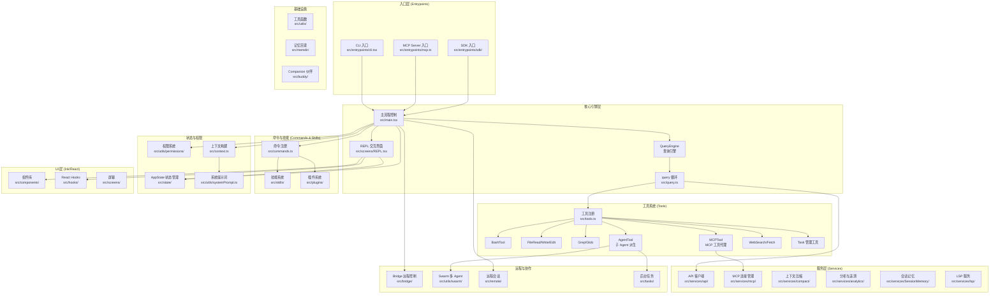

# 项目全貌分析：Claude Code

## 1. 项目概述

Claude Code 是 Anthropic 开发的一款基于终端的 AI 编程助手（CLI + REPL），它将 Claude 大语言模型深度集成到开发者的命令行工作流中。用户可以通过自然语言与 Claude 交互，执行代码编辑、文件操作、Shell 命令、Web 搜索等开发任务。项目使用 TypeScript + Bun 运行时构建，前端 TUI 基于 Ink（React for CLI）渲染，支持交互式 REPL 和非交互式 print 两种模式，并具备 MCP（Model Context Protocol）集成、插件系统、多 Agent 协作（Swarm/Teammate）、远程会话（Bridge/SSH/Teleport）等高级能力。

## 2. 系统架构图



## 3. 核心功能清单

| 功能名称 | 一句话描述 | 核心模块/文件 | 复杂度评估 |
|----------|-----------|-------------|-----------|
| 查询引擎与 AI 对话循环 | 管理用户消息提交、Claude API 调用、工具调用循环的核心引擎 | `src/QueryEngine.ts`, `src/query.ts`, `src/services/api/` | 高 |
| 工具系统 | 定义、注册、权限控制和执行 30+ 种内置工具（Bash、文件操作、搜索等） | `src/Tool.ts`, `src/tools.ts`, `src/tools/` | 高 |
| 权限与安全系统 | 多层权限模式（默认/自动/绕过）、工具调用分类器、文件系统沙箱 | `src/utils/permissions/` | 高 |
| MCP 集成 | Model Context Protocol 服务器连接管理、工具代理、资源读取 | `src/services/mcp/`, `src/tools/MCPTool/` | 高 |
| 命令与技能系统 | 斜杠命令注册、技能加载、插件系统、MCP 技能桥接 | `src/commands.ts`, `src/skills/`, `src/plugins/` | 中 |
| REPL 交互界面 | 基于 Ink 的终端 TUI，消息渲染、输入处理、虚拟滚动 | `src/screens/REPL.tsx`, `src/components/` | 高 |
| 状态管理 | 全局 AppState 存储、React 状态绑定、会话状态持久化 | `src/state/`, `src/utils/sessionState.ts` | 中 |
| 上下文与提示词构建 | 系统提示词组装、Git 状态注入、CLAUDE.md 加载、用户上下文 | `src/context.ts`, `src/utils/systemPrompt.ts`, `src/utils/claudemd.ts` | 中 |
| 多 Agent 协作（Swarm） | Agent 派生、团队管理、Teammate 通信、tmux/进程内模式 | `src/utils/swarm/`, `src/tools/AgentTool/`, `src/tasks/` | 高 |
| 远程会话与 Bridge | 远程控制桥接、SSH 远程、WebSocket 传输、会话重连 | `src/bridge/`, `src/remote/`, `src/server/` | 高 |
| 后台任务系统 | Shell 任务、Agent 任务、远程任务的生命周期管理 | `src/Task.ts`, `src/tasks.ts`, `src/tasks/` | 中 |
| 记忆与会话持久化 | 会话历史存储、记忆提取、跨会话记忆、团队记忆同步 | `src/memdir/`, `src/services/SessionMemory/`, `src/assistant/` | 中 |
| 上下文压缩系统 | 五层递进压缩策略管理长对话上下文窗口 | `src/services/compact/` | 高 |
| 插件系统 | DXT 格式插件的加载、安装、marketplace 集成 | `src/plugins/`, `src/services/plugins/`, `src/utils/dxt/` | 中 |
| 认证与 OAuth 系统 | OAuth 2.0 PKCE 流程、API Key 管理、多提供商认证 | `src/services/oauth/`, `src/utils/auth.ts` | 中 |
| 设置与配置系统 | 六层设置合并、MDM 策略、远程设置同步 | `src/utils/settings/`, `src/services/remoteManagedSettings/` | 中 |
| 遥测与分析系统 | 事件日志 sink 架构、GrowthBook feature flags | `src/services/analytics/` | 中 |
| 推测执行（Speculation） | 预测用户意图提前执行查询，overlay 文件系统隔离 | `src/services/PromptSuggestion/` | 高 |
| 非交互式模式（Print/SDK） | `-p` 模式和 SDK stream-json 双向控制协议 | `src/cli/print.ts`, `src/cli/structuredIO.ts` | 高 |
| Hooks 生命周期系统 | 可扩展的生命周期钩子（command/prompt/agent/http） | `src/utils/hooks/` | 中 |
| LSP 集成 | 语言服务器协议集成，代码诊断与被动反馈 | `src/services/lsp/` | 中 |
| 费用追踪与 Token 管理 | 按模型分类的费用统计、预算控制、会话持久化 | `src/cost-tracker.ts`, `src/utils/modelCost.ts` | 中 |

## 4. 目录结构心智模型

```
src/
├── entrypoints/          # 入口点：CLI、MCP Server、SDK
├── main.tsx              # 🔑 主流程控制：启动、命令注册、路由
├── screens/              # 屏幕：REPL 主界面、Doctor 诊断、会话恢复
│
├── QueryEngine.ts        # 🔑 查询引擎：消息提交与 AI 对话循环
├── query.ts              # 🔑 查询循环：API 调用、工具调用、流式响应
├── Tool.ts               # 🔑 工具基类：Tool 接口定义与权限检查
├── tools.ts              # 工具注册与过滤
├── tools/                # 🔑 30+ 内置工具实现
│   ├── BashTool/         #   Shell 命令执行
│   ├── FileEditTool/     #   文件编辑
│   ├── FileReadTool/     #   文件读取
│   ├── FileWriteTool/    #   文件写入
│   ├── GrepTool/         #   文本搜索
│   ├── GlobTool/         #   文件搜索
│   ├── AgentTool/        #   子 Agent 派生
│   ├── MCPTool/          #   MCP 工具代理
│   ├── WebSearchTool/    #   Web 搜索
│   ├── WebFetchTool/     #   Web 内容获取
│   ├── TaskCreateTool/   #   后台任务创建
│   └── ...
│
├── commands.ts           # 命令注册与查找
├── commands/             # 🔑 80+ 斜杠命令实现
├── skills/               # 技能系统：内置技能、技能加载
├── plugins/              # 插件系统：内置插件注册
│
├── services/             # 🔑 服务层
│   ├── api/              #   Anthropic API 客户端
│   ├── mcp/              #   MCP 连接管理
│   ├── compact/          #   上下文压缩
│   ├── analytics/        #   遥测分析
│   ├── SessionMemory/    #   会话记忆
│   ├── lsp/              #   LSP 语言服务
│   └── plugins/          #   插件服务
│
├── state/                # 🔑 AppState 全局状态管理
├── context.ts            # 上下文构建（Git、CLAUDE.md）
├── utils/                # 工具函数库
│   ├── permissions/      #   🔑 权限系统
│   ├── swarm/            #   🔑 多 Agent 协作
│   ├── settings/         #   设置管理
│   ├── model/            #   模型配置
│   ├── hooks/            #   生命周期钩子
│   └── ...
│
├── bridge/               # 🔑 远程控制桥接
├── remote/               # 远程会话管理
├── server/               # Direct Connect 服务端
├── tasks/                # 后台任务类型实现
│
├── components/           # Ink/React UI 组件库
├── hooks/                # React Hooks
├── memdir/               # 记忆目录管理
├── buddy/                # Companion 伙伴功能
├── voice/                # 语音输入
├── vim/                  # Vim 模式
└── types/                # 类型定义
```

## 5. 核心数据流

```
用户输入（CLI/REPL/SDK）
  → main.tsx 路由（交互式 REPL / 非交互式 print）
    → QueryEngine.submitMessage()
      → 构建系统提示词 + 用户上下文 + 消息历史
        → query() 调用 Anthropic API（流式）
          → 解析响应：文本块 / 工具调用块
            → 工具调用 → 权限检查 → Tool.call() 执行
              → 工具结果注入消息历史 → 继续 queryLoop
            → 文本响应 → 渲染到 REPL / 输出到 stdout
```


## 模块深度分析索引

以下是各核心模块的功能概述及其详细分析文档路径，可用于按需加载模块上下文。

| 模块名称 | 功能概述 | 分析文档 |
|----------|---------|---------|
| 查询引擎与 AI 对话循环 | 管理用户消息提交、Claude API 流式调用、工具调用执行循环及上下文自动压缩的核心驱动模块 | `docs/query-engine-analysis.md` |
| 工具系统 | 定义 30+ 种内置工具的注册、过滤、权限检查和执行调度，通过 MCP 支持无限扩展 | `docs/tool-system-analysis.md` |
| 权限与安全系统 | 多层权限模式、基于规则的工具访问控制、文件系统路径沙箱和 Auto Mode AI 分类器 | `docs/permission-system-analysis.md` |
| MCP 集成 | 连接外部 MCP 服务器，支持多种传输协议，动态注册工具并管理服务器生命周期 | `docs/mcp-integration-analysis.md` |
| 命令与技能系统 | 管理 80+ 种斜杠命令和技能，支持内置/用户/MCP/插件多来源扩展 | `docs/commands-skills-analysis.md` |
| REPL 交互界面 | 基于 Ink/React 的终端 TUI，负责消息渲染、输入处理、虚拟滚动和 80+ Hooks 副作用管理 | `docs/repl-ui-analysis.md` |
| 状态管理 | 基于自定义 Store 的全局 AppState 管理，通过 React Context 和 selector 驱动精确更新 | `docs/state-management-analysis.md` |
| 上下文与提示词构建 | 组装系统提示词、用户上下文（CLAUDE.md）和系统上下文（Git 状态），支持多优先级来源 | `docs/context-prompt-analysis.md` |
| 多 Agent 协作（Swarm） | 通过 AgentTool 派生子 Agent，支持进程内和 tmux 两种模式的并行任务执行 | `docs/swarm-multi-agent-analysis.md` |
| 远程会话与 Bridge | 轮询式远程控制协议，支持 Bridge/SSH/Direct Connect/Teleport 多种远程模式 | `docs/remote-bridge-analysis.md` |
| 后台任务系统 | 管理 Shell/Agent/远程/Teammate 等异步任务的完整生命周期 | `docs/background-tasks-analysis.md` |
| 记忆与会话持久化 | 会话历史 JSONL 持久化、记忆提取与检索、团队记忆同步，支持会话恢复 | `docs/memory-session-analysis.md` |
| 上下文压缩系统 | 五层递进压缩策略（Snip/Microcompact/Collapse/Autocompact/Reactive），解决长对话上下文溢出 | `docs/context-compaction-analysis.md` |
| 插件系统 | DXT 格式插件的加载、安装、marketplace 集成与多作用域生命周期管理 | `docs/plugin-system-analysis.md` |
| 认证与 OAuth 系统 | OAuth 2.0 PKCE 流程、API Key 认证、多提供商支持和 keychain 安全存储 | `docs/auth-oauth-analysis.md` |
| 设置与配置系统 | 六层设置来源合并（policy/managed/user/project/local/CLI），支持 MDM 和远程同步 | `docs/settings-config-analysis.md` |
| 遥测与分析系统 | 零依赖 sink 架构的事件日志、GrowthBook feature flags、类型安全防泄露 | `docs/telemetry-analytics-analysis.md` |
| 推测执行（Speculation） | 预测用户意图提前执行 API 查询，overlay 文件系统隔离，支持 pipelined 模式 | `docs/speculation-analysis.md` |
| 非交互式模式（Print/SDK） | headless 执行路径，支持 text/json/stream-json 输出和 SDK 双向控制协议 | `docs/print-sdk-mode-analysis.md` |
| Hooks 生命周期系统 | 五种 hook 类型在 SessionStart/PreToolUse/PostToolUse/Stop 等节点注入自定义逻辑 | `docs/hooks-lifecycle-analysis.md` |
| LSP 集成 | 语言服务器协议集成，提供代码诊断并作为被动反馈注入模型上下文 | `docs/lsp-integration-analysis.md` |
| 费用追踪与 Token 管理 | 按模型分类的 token 用量和费用统计，支持预算控制和会话费用持久化 | `docs/cost-token-tracking-analysis.md` |
