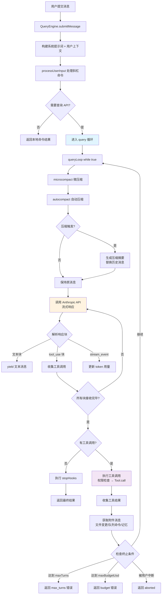

# 查询引擎与 AI 对话循环 - 深度分析

## 6.1 功能概述

查询引擎是 Claude Code 的核心驱动模块，负责管理用户消息的提交、Claude API 的流式调用、工具调用的执行循环以及上下文的自动压缩。它由 `QueryEngine` 类（SDK/非交互式入口）和 `query()`/`queryLoop()` 函数（底层循环引擎）组成，实现了一个完整的 "消息 → API 调用 → 工具执行 → 结果注入 → 再次调用" 的 agentic 循环，直到模型不再请求工具调用或达到预算/轮次限制为止。

## 6.2 核心流程图



## 6.3 核心调用链

```
QueryEngine.submitMessage()                    # src/QueryEngine.ts:L209
  → fetchSystemPromptParts()                   # 构建系统提示词
  → processUserInput()                         # src/utils/processUserInput/
      → 处理斜杠命令 / 普通文本
  → recordTranscript()                         # 持久化用户消息
  → query()                                    # src/query.ts:L219
      → queryLoop()                            # src/query.ts:L241
          → microcompact()                     # 微压缩（工具结果裁剪）
          → autocompact()                      # 自动压缩（上下文摘要）
          → deps.callModel()                   # 调用 API
              → queryModelWithStreaming()       # src/services/api/claude.ts:L752
                  → queryModel()               # src/services/api/claude.ts:L1017
                      → Anthropic SDK stream    # @anthropic-ai/sdk
          → StreamingToolExecutor / runTools()  # 工具执行
              → canUseTool()                   # 权限检查
              → tool.call()                    # 工具实际执行
          → getAttachmentMessages()            # 附件（文件变更、队列命令）
          → [循环继续 or 返回]
```

## 6.4 关键数据结构

```typescript
// 查询引擎配置
interface QueryEngineConfig {
  cwd: string                          // 工作目录
  commands: Command[]                  // 可用命令列表
  tools: Tools                         // 可用工具列表
  mcpClients: MCPServerConnection[]    // MCP 服务器连接
  canUseTool: CanUseToolFn             // 权限检查函数
  customSystemPrompt?: string          // 自定义系统提示词
  appendSystemPrompt?: string          // 追加系统提示词
  userSpecifiedModel?: string          // 用户指定模型
  fallbackModel?: string               // 降级模型
  maxTurns?: number                    // 最大轮次
  maxBudgetUsd?: number                // 最大预算（美元）
  taskBudget?: { total: number }       // API 侧 token 预算
  initialMessages?: Message[]          // 初始消息历史
  abortController?: AbortController    // 中断控制器
  readFileCache: FileStateCache        // 文件读取缓存
  getAppState: () => AppState          // 获取全局状态
  setAppState: SetAppState             // 设置全局状态
}

// queryLoop 内部可变状态
interface State {
  messages: Message[]                  // 当前消息数组
  toolUseContext: ProcessUserInputContext  // 工具执行上下文
  autoCompactTracking?: AutoCompactTracking  // 压缩追踪
  maxOutputTokensOverride?: number     // 输出 token 上限覆盖
  maxOutputTokensRecoveryCount: number // max_output_tokens 恢复次数
  hasAttemptedReactiveCompact: boolean // 是否已尝试响应式压缩
  turnCount: number                    // 当前轮次计数
  pendingToolUseSummary?: Promise<...> // 待处理的工具摘要
  stopHookActive?: boolean             // stop hook 是否激活
  transition?: { reason: string }      // 状态转换原因
}

// SDK 消息类型（yield 输出）
type SDKMessage =
  | SDKSystemInitMessage       // 系统初始化信息
  | SDKAssistantMessage        // 助手响应
  | SDKUserMessageReplay       // 用户消息回放
  | SDKCompactBoundaryMessage  // 压缩边界
  | SDKResultMessage           // 最终结果（success/error）
  | SDKStreamEvent             // 流式事件（token 用量等）
```

## 6.5 设计决策分析

### 决策 1：AsyncGenerator 流式架构

- 问题：如何在长时间运行的 AI 对话中实时传递中间结果？
- 方案：`submitMessage()` 和 `queryLoop()` 都使用 `async function*`（AsyncGenerator），通过 `yield` 逐步输出消息。
- 原因：AsyncGenerator 天然支持背压（backpressure），消费者可以按需拉取；同时支持 `for await...of` 语法，代码可读性好。
- Trade-off：Generator 的错误处理和生命周期管理比 Promise 复杂；`yield*` 委托时的中断传播需要特别注意。

### 决策 2：while(true) 循环 + State 对象

- 问题：queryLoop 需要在多种条件下重试（压缩后重试、max_output_tokens 恢复、stop hook 阻塞等），如何管理复杂的状态转换？
- 方案：使用 `while(true)` 无限循环 + 显式 `State` 对象，每次 `continue` 时构造新的 `state` 对象。
- 原因：避免递归调用导致的栈溢出（长会话可能有数百轮）；State 对象使状态转换显式可追踪。
- Trade-off：循环体非常长（~1200 行），理解控制流需要追踪所有 `continue` 和 `return` 点。

### 决策 3：多层压缩策略

- 问题：长对话的上下文会超过模型的 token 限制。
- 方案：四层递进压缩：snip（历史裁剪）→ microcompact（工具结果裁剪）→ context collapse（上下文折叠）→ autocompact（全量摘要压缩）。
- 原因：每层压缩的粒度和成本不同，先用低成本方式尝试，不够再升级。
- Trade-off：四层压缩的交互和优先级关系复杂，需要仔细处理边界条件（如压缩后仍然超限的情况）。

### 决策 4：StreamingToolExecutor 并行工具执行

- 问题：模型可能在一次响应中请求多个工具调用，串行执行太慢。
- 方案：`StreamingToolExecutor` 在流式接收 tool_use 块时就开始执行工具，不等所有块接收完毕。
- 原因：显著减少工具执行的总延迟，特别是当模型同时请求多个独立工具时。
- Trade-off：需要处理流式中断时的清理（discard 未完成的工具）、工具结果的顺序保证。

## 6.6 错误处理策略

| 错误类型 | 处理方式 |
|---------|---------|
| Prompt Too Long (413) | 先尝试 context collapse drain → 再尝试 reactive compact → 都失败则 surface 错误 |
| Max Output Tokens | 先尝试 escalate 到 64k → 再注入 meta 消息要求继续 → 最多重试 N 次 |
| Media Size Error | 通过 reactive compact 裁剪媒体内容后重试 |
| Model Fallback | 捕获 `FallbackTriggeredError`，切换到 fallback model 重试 |
| API Rate Limit | 由 `claude.ts` 内部处理重试，yield `api_retry` 系统消息 |
| 用户中断 (Ctrl+C) | 检查 `abortController.signal.aborted`，yield 中断消息，清理工具执行 |
| 预算超限 | 每轮检查 `getTotalCost() >= maxBudgetUsd`，超限则 yield error result |
| 轮次超限 | 每轮检查 `turnCount > maxTurns`，超限则 yield max_turns_reached |

## 6.7 关键代码位置索引

| 文件 | 关键内容 |
|------|---------|
| `src/QueryEngine.ts` | QueryEngine 类，SDK/非交互式入口，消息提交与结果收集 |
| `src/query.ts` | query() 和 queryLoop()，核心 agentic 循环 |
| `src/query/config.ts` | QueryConfig 构建，feature gate 快照 |
| `src/query/tokenBudget.ts` | Token 预算追踪与续写决策 |
| `src/query/stopHooks.ts` | Stop hooks 执行（模型响应后的检查） |
| `src/query/deps.ts` | 依赖注入（callModel, autocompact, microcompact） |
| `src/services/api/claude.ts` | Anthropic API 调用，流式响应处理，缓存控制 |
| `src/services/api/client.ts` | API 客户端创建，认证头配置 |
| `src/services/compact/` | 上下文压缩服务 |
| `src/utils/processUserInput/` | 用户输入处理（斜杠命令解析等） |
