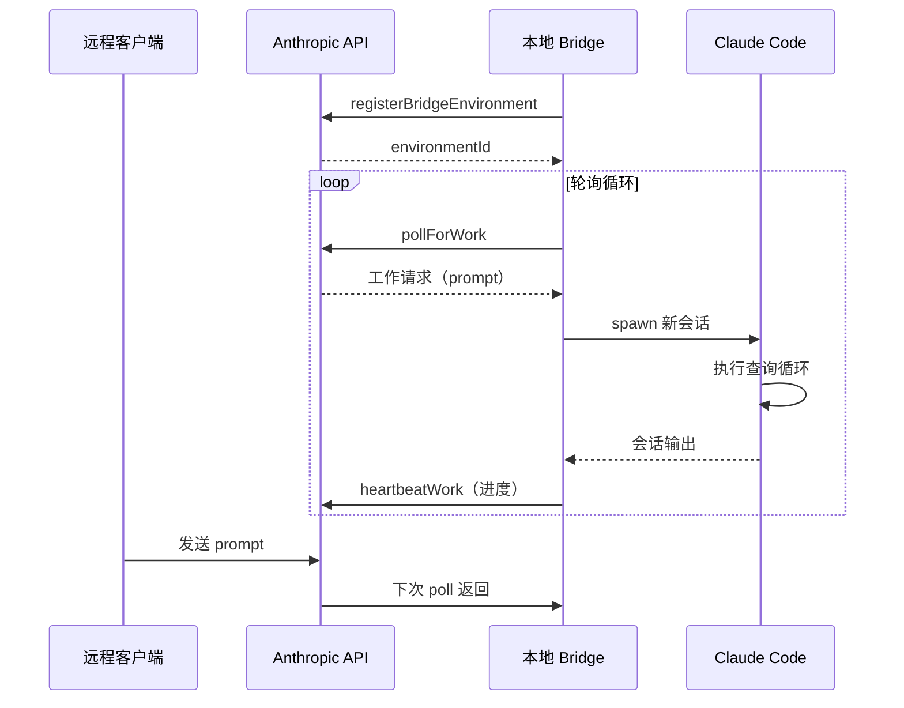

# 远程会话与 Bridge - 深度分析

## 6.1 功能概述

远程会话与 Bridge 模块使 Claude Code 能够在远程环境中运行并被远程控制。Bridge 系统实现了一个轮询式的远程控制协议：本地 Claude Code 实例注册为"环境"，远程客户端（如 Web UI）通过 API 发送工作请求，本地实例轮询获取并执行。此外还支持 SSH 远程（在远程机器上启动 Claude Code）、Direct Connect（WebSocket 直连）和 Teleport（会话迁移）。

## 6.2 核心流程图



## 6.3 核心调用链

```
initReplBridge()                               # src/bridge/initReplBridge.ts
  → bridgeMain()                               # src/bridge/bridgeMain.ts
      → registerBridgeEnvironment()            # 注册环境
      → pollForWork()                          # 轮询工作
      → sessionRunner()                        # src/bridge/sessionRunner.ts
          → spawn() 新 Claude Code 进程
          → 监控输出 / heartbeat

// SSH 远程
claude ssh <host>                              # main.tsx SSH 处理
  → SSH 连接到远程机器
  → 在远程启动 claude 进程

// Direct Connect
createDirectConnectSession()                   # src/server/createDirectConnectSession.ts
  → WebSocket 连接
  → 双向消息传递
```

## 6.7 关键代码位置索引

| 文件 | 关键内容 |
|------|---------|
| `src/bridge/bridgeMain.ts` | Bridge 主循环 |
| `src/bridge/types.ts` | Bridge API 接口定义 |
| `src/bridge/sessionRunner.ts` | 会话运行器 |
| `src/bridge/pollConfig.ts` | 轮询配置 |
| `src/bridge/replBridge.ts` | REPL Bridge 集成 |
| `src/bridge/jwtUtils.ts` | JWT 认证工具 |
| `src/remote/RemoteSessionManager.ts` | 远程会话管理 |
| `src/remote/SessionsWebSocket.ts` | WebSocket 会话 |
| `src/server/` | Direct Connect 服务端 |
