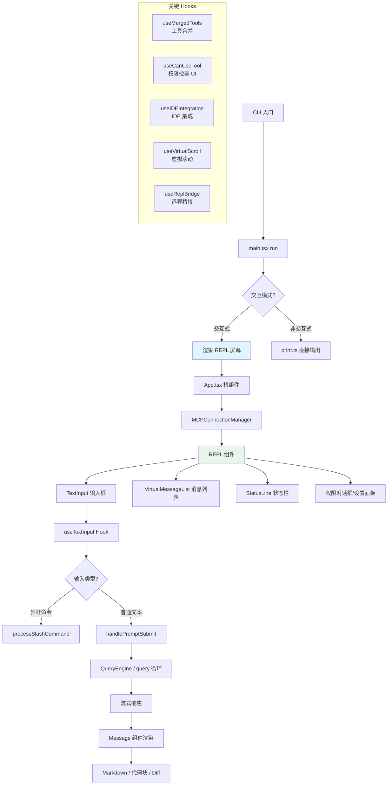

# REPL 交互界面 - 深度分析

## 6.1 功能概述

REPL 交互界面是 Claude Code 的主要用户交互层，基于 Ink（React for CLI）构建的终端 TUI。它负责消息渲染（Markdown、代码高亮、diff 展示）、用户输入处理（文本输入、Vim 模式、粘贴、图片）、虚拟滚动、权限对话框、工具进度展示、状态栏以及大量的 React Hooks 驱动的副作用管理（MCP 连接、IDE 集成、会话恢复等）。

## 6.2 核心流程图



## 6.3 核心调用链

```
REPL({ ... })                                  # src/screens/REPL.tsx:L572
  → useMergedTools()                           # src/hooks/useMergedTools.ts
  → useCanUseTool()                            # src/hooks/useCanUseTool.tsx
  → useTextInput()                             # src/hooks/useTextInput.ts
  → useQueueProcessor()                        # src/hooks/useQueueProcessor.ts
  → handlePromptSubmit()                       # src/utils/handlePromptSubmit.ts
      → QueryEngine / query 循环
  → VirtualMessageList                         # src/components/VirtualMessageList.tsx
      → Message → MessageResponse              # 消息渲染链
```

## 6.4 关键数据结构

```typescript
// REPL 组件 Props（简化）
type REPLProps = {
  commands: Command[]
  tools: Tools
  mcpClients: MCPServerConnection[]
  dynamicMcpConfig: Record<string, ScopedMcpServerConfig>
  permissionMode: PermissionMode
  systemPrompt?: string
  // ... 大量配置项
}
```

## 6.5 设计决策分析

- Ink/React 架构：利用 React 的声明式 UI 和组件化，在终端中实现复杂的交互界面
- 虚拟滚动：`VirtualMessageList` 只渲染可见区域的消息，支持长对话的流畅滚动
- Hook 驱动副作用：80+ 个 React Hooks 管理各种异步副作用（MCP、IDE、语音、桥接等）
- 消息渲染管线：Message → MessageResponse → Markdown/HighlightedCode/StructuredDiff 多层渲染

## 6.7 关键代码位置索引

| 文件 | 关键内容 |
|------|---------|
| `src/screens/REPL.tsx` | REPL 主屏幕组件 |
| `src/components/App.tsx` | 应用根组件 |
| `src/components/Messages.tsx` | 消息列表 |
| `src/components/Message.tsx` | 单条消息渲染 |
| `src/components/VirtualMessageList.tsx` | 虚拟滚动消息列表 |
| `src/components/TextInput.tsx` | 文本输入组件 |
| `src/components/Markdown.tsx` | Markdown 渲染 |
| `src/components/StructuredDiff.tsx` | Diff 渲染 |
| `src/components/permissions/` | 权限对话框组件 |
| `src/hooks/` | 80+ React Hooks |
