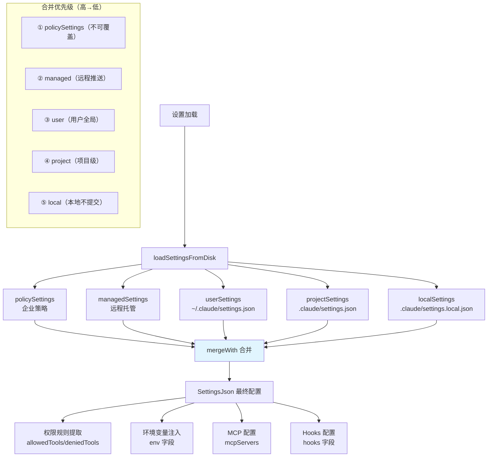

# 设置与配置系统 - 深度分析

## 6.1 功能概述

设置与配置系统管理 Claude Code 的所有运行时配置，支持六层设置来源的合并：企业策略（policySettings）→ 远程托管（managed）→ 用户级（~/.claude/settings.json）→ 项目级（.claude/settings.json）→ 本地级（.claude/settings.local.json）→ CLI 参数。设置内容涵盖权限规则、模型选择、MCP 配置、环境变量注入、hooks 定义等。系统支持 MDM（Mobile Device Management）策略、远程设置同步和热重载。

## 6.2 核心流程图



## 6.3 关键数据结构

```typescript
// 设置来源
type SettingSource = 'policySettings' | 'managed' | 'user' | 'project' | 'local'

// 设置 JSON 结构（简化）
type SettingsJson = {
  permissions?: {
    allow?: PermissionRuleValue[]    // 始终允许的工具规则
    deny?: PermissionRuleValue[]     // 始终拒绝的工具规则
    ask?: PermissionRuleValue[]      // 始终询问的工具规则
  }
  env?: Record<string, string>       // 环境变量注入
  mcpServers?: Record<string, McpServerConfig>  // MCP 服务器
  hooks?: HooksSettings              // Hooks 配置
  defaultMode?: PermissionMode       // 默认权限模式
  model?: string                     // 默认模型
  // ... 更多字段
}
```

## 6.5 设计决策分析

- 六层合并：企业策略不可覆盖，用户设置优先于项目设置（安全考虑），local 不提交 git
- MDM 支持：通过 `policySettings` 支持企业 MDM 策略推送
- 热重载：`useSettings` Hook 监听文件变更，自动重新加载设置
- 环境变量注入：settings.json 的 `env` 字段可以注入环境变量（如 PATH），但需要信任检查

## 6.7 关键代码位置索引

| 文件 | 关键内容 |
|------|---------|
| `src/utils/settings/settings.ts` | 设置加载、合并、查询核心逻辑 |
| `src/utils/settings/types.ts` | SettingsJson 类型定义 |
| `src/utils/settings/constants.ts` | SettingSource 常量 |
| `src/utils/settings/validation.ts` | 设置验证 |
| `src/utils/settings/mdm/` | MDM 策略加载 |
| `src/services/remoteManagedSettings/` | 远程设置同步 |
| `src/services/settingsSync/` | 设置上传同步 |
| `src/hooks/useSettings.ts` | 设置变更监听 Hook |
| `src/utils/config.ts` | 全局配置（globalConfig） |
