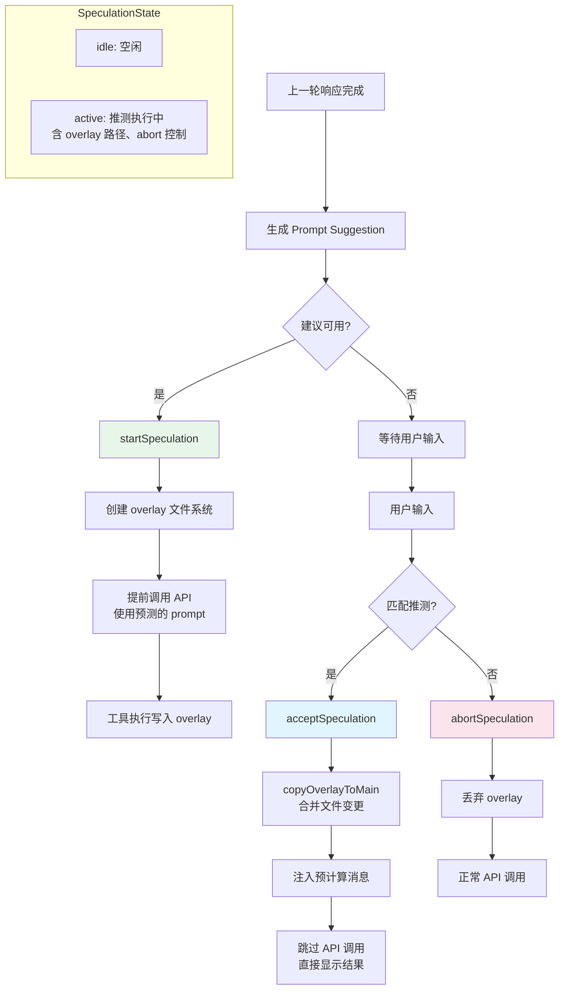

# 推测执行（Speculation） - 深度分析

## 6.1 功能概述

推测执行系统在用户输入消息之前，预测用户可能的下一步操作并提前启动 API 查询，从而显著减少感知延迟。当用户接受建议时，预计算的结果直接注入对话，跳过等待时间。系统使用 overlay 文件系统隔离推测执行的文件写入，只在用户确认后才将变更合并到主文件系统。支持 pipelined speculation（在上一轮响应完成前就开始下一轮推测）。

## 6.2 核心流程图



## 6.3 核心调用链

```
startSpeculation()                             # src/services/PromptSuggestion/speculation.ts:L402
  → 创建 overlay 目录
  → 启动 query 循环（使用预测 prompt）
  → 工具写入重定向到 overlay
  → 更新 SpeculationState 为 active

acceptSpeculation()                            # speculation.ts:L717
  → copyOverlayToMain()                       # 合并 overlay 文件到主 FS
  → prepareMessagesForInjection()             # 准备注入的消息
  → 更新 AppState（timeSavedMs 等）

abortSpeculation()                             # speculation.ts:L802
  → abort() 中断推测查询
  → safeRemoveOverlay() 清理 overlay
  → resetSpeculationState()
```

## 6.4 关键数据结构

```typescript
type SpeculationState =
  | { status: 'idle' }
  | {
      status: 'active'
      id: string                          // 推测 ID
      abort: () => void                   // 中断函数
      startTime: number                   // 开始时间
      messagesRef: { current: Message[] } // 可变引用：推测消息
      writtenPathsRef: { current: Set<string> }  // overlay 写入路径
      boundary: CompletionBoundary | null // 完成边界
      suggestionLength: number            // 建议文本长度
      toolUseCount: number                // 工具调用次数
      isPipelined: boolean                // 是否 pipelined
      pipelinedSuggestion?: {             // pipelined 建议
        text: string
        promptId: 'user_intent' | 'stated_intent'
      }
    }
```

## 6.5 设计决策分析

- Overlay 文件系统：推测执行的文件写入隔离在 overlay 目录，避免污染主文件系统
- Mutable Ref：使用 `{ current: T }` 模式避免每条消息都 spread 数组，减少 GC 压力
- CompletionBoundary：记录推测执行的"边界"（完成/bash/edit/denied），用于判断是否可以接受
- Pipelined Speculation：在模型还在响应时就开始下一轮推测，进一步减少延迟

## 6.7 关键代码位置索引

| 文件 | 关键内容 |
|------|---------|
| `src/services/PromptSuggestion/speculation.ts` | 推测执行核心（start/accept/abort） |
| `src/services/PromptSuggestion/promptSuggestion.ts` | Prompt 建议生成 |
| `src/state/AppStateStore.ts` | SpeculationState 类型定义 |
| `src/hooks/usePromptSuggestion.ts` | 推测执行 React Hook |
