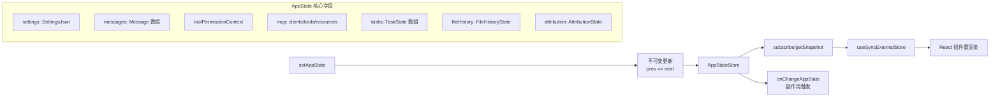

# 状态管理 - 深度分析

## 6.1 功能概述

状态管理模块基于自定义的 Store 模式（类似 Zustand）实现全局 AppState 的管理。AppState 是一个 DeepImmutable 的大型状态对象，包含设置、消息、工具权限、MCP 连接、任务、文件历史、归因追踪等所有运行时状态。通过 React Context 和 `useSyncExternalStore` 提供给 UI 组件，支持选择器（selector）驱动的精确更新。

## 6.2 核心流程图



## 6.3 关键数据结构

```typescript
type AppState = DeepImmutable<{
  settings: SettingsJson           // 用户设置
  verbose: boolean                 // 详细模式
  mainLoopModel: ModelSetting      // 当前模型
  messages: Message[]              // 消息历史
  toolPermissionContext: ToolPermissionContext  // 权限上下文
  mcp: {
    clients: MCPServerConnection[] // MCP 连接
    tools: Tool[]                  // MCP 工具
    resources: Record<string, ServerResource[]>
  }
  tasks: TaskState[]               // 后台任务
  fileHistory: FileHistoryState    // 文件历史快照
  attribution: AttributionState    // 代码归因
  plugins: { enabled: LoadedPlugin[], errors: PluginError[] }
  // ... 更多字段
}>
```

## 6.7 关键代码位置索引

| 文件 | 关键内容 |
|------|---------|
| `src/state/AppState.tsx` | AppStateProvider、useAppState、useSetAppState |
| `src/state/AppStateStore.ts` | AppState 类型定义、getDefaultAppState |
| `src/state/store.ts` | Store 实现（subscribe/getSnapshot） |
| `src/state/selectors.ts` | 状态选择器 |
| `src/state/onChangeAppState.ts` | 状态变更副作用 |
