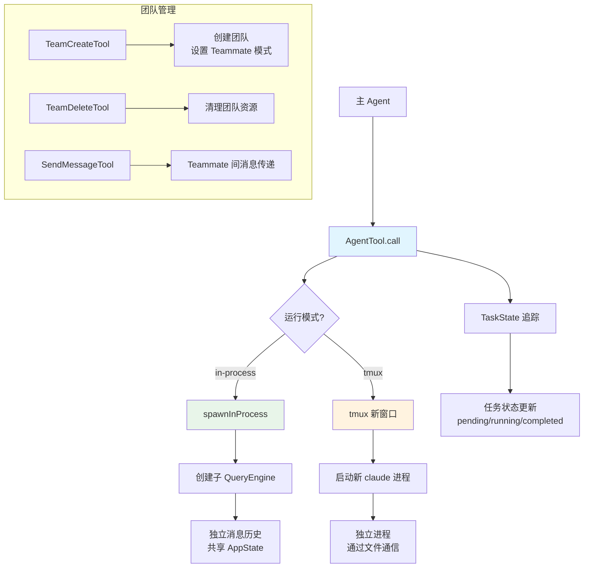

# 多 Agent 协作（Swarm） - 深度分析

## 6.1 功能概述

多 Agent 协作系统（Swarm）允许主 Agent 通过 `AgentTool` 派生子 Agent（Teammate），实现并行任务执行。支持两种运行模式：进程内模式（in-process，共享内存）和 tmux 模式（独立终端进程）。团队通过 `TeamCreateTool`/`TeamDeleteTool` 管理，Teammate 之间通过 `SendMessageTool` 通信。每个 Teammate 有独立的会话上下文、权限继承和工具集。

## 6.2 核心流程图



## 6.3 核心调用链

```
AgentTool.call({ name, prompt })               # src/tools/AgentTool/AgentTool.ts
  → createSubagentContext()                    # 创建子 agent 上下文
  → runForkedAgent() / spawnInProcess()        # 执行子 agent
      → query() 循环                          # 独立的查询循环
  → 收集结果 → 返回给主 agent

TeamCreateTool.call({ name })                  # src/tools/TeamCreateTool/
  → setDynamicTeamContext()                    # 设置团队上下文
  → 配置 Teammate 模式（in-process/tmux）
```

## 6.7 关键代码位置索引

| 文件 | 关键内容 |
|------|---------|
| `src/tools/AgentTool/` | Agent 派生工具、Agent 定义加载 |
| `src/utils/swarm/` | Swarm 核心：进程内运行、tmux 运行、权限同步 |
| `src/utils/swarm/spawnInProcess.ts` | 进程内 Teammate 启动 |
| `src/utils/swarm/teammateInit.ts` | Teammate 初始化 |
| `src/utils/swarm/leaderPermissionBridge.ts` | Leader-Teammate 权限桥接 |
| `src/tools/TeamCreateTool/` | 团队创建工具 |
| `src/tools/SendMessageTool/` | Teammate 间消息工具 |
| `src/tasks/InProcessTeammateTask/` | 进程内 Teammate 任务 |
