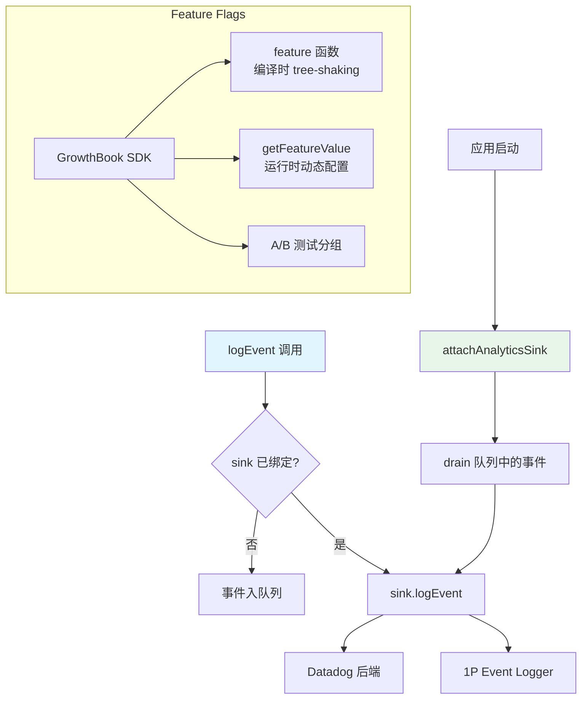

# 遥测与分析系统 - 深度分析

## 6.1 功能概述

遥测与分析系统负责 Claude Code 的运行时数据收集和 feature flag 管理。事件日志通过 `logEvent()` API 收集，采用 sink 架构延迟绑定后端（Datadog/1P Event Logger）。GrowthBook 提供 feature flag 和动态配置（A/B 测试、渐进发布）。系统设计为零依赖入口（避免循环导入），事件在 sink 绑定前排队，绑定后异步 drain。所有字符串元数据需要通过 `AnalyticsMetadata_I_VERIFIED_THIS_IS_NOT_CODE_OR_FILEPATHS` 类型标记，防止意外记录代码或文件路径。

## 6.2 核心流程图



## 6.3 关键数据结构

```typescript
// 分析 sink 接口
type AnalyticsSink = {
  logEvent: (eventName: string, metadata: LogEventMetadata) => void
  logEventAsync: (eventName: string, metadata: LogEventMetadata) => Promise<void>
}

// 事件元数据（禁止字符串，防止泄露代码/路径）
type LogEventMetadata = { [key: string]: boolean | number | undefined }
```

## 6.5 设计决策分析

- 零依赖入口：`analytics/index.ts` 无任何导入，避免循环依赖
- Sink 延迟绑定：事件在启动早期就可以记录，sink 在初始化完成后绑定
- 类型安全防泄露：`AnalyticsMetadata_I_VERIFIED_THIS_IS_NOT_CODE_OR_FILEPATHS` 强制开发者确认不含敏感信息
- `_PROTO_*` 键隔离：PII 数据通过特殊前缀路由到受保护的存储列，非 1P sink 自动剥离

## 6.7 关键代码位置索引

| 文件 | 关键内容 |
|------|---------|
| `src/services/analytics/index.ts` | logEvent/logEventAsync 公共 API |
| `src/services/analytics/sink.ts` | Sink 实现与事件路由 |
| `src/services/analytics/growthbook.ts` | GrowthBook feature flag 集成 |
| `src/services/analytics/datadog.ts` | Datadog 后端 |
| `src/services/analytics/firstPartyEventLogger.ts` | 1P 事件日志 |
| `src/services/analytics/metadata.ts` | 事件元数据丰富 |
| `src/services/analytics/config.ts` | 分析配置 |
