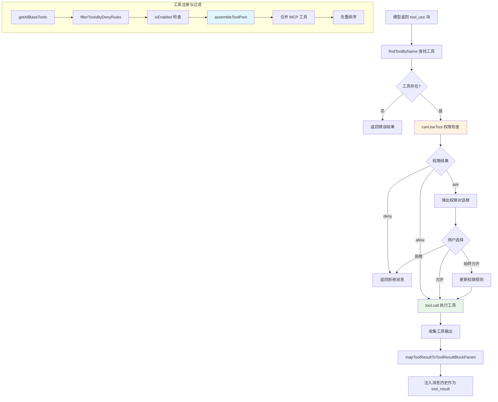

# 工具系统 - 深度分析

## 6.1 功能概述

工具系统是 Claude Code 的执行引擎，定义了 AI 模型可以调用的所有操作能力。它包含 30+ 种内置工具（文件读写、Shell 执行、Web 搜索、Agent 派生等），并通过 MCP 协议支持无限扩展。工具系统负责工具的注册、过滤（基于权限和 feature flag）、权限检查、执行调度和结果渲染，是连接 AI 模型与真实世界操作的桥梁。

## 6.2 核心流程图



## 6.3 核心调用链

```
getTools(permissionContext)                     # src/tools.ts:L271
  → getAllBaseTools()                           # src/tools.ts:L193 - 收集所有内置工具
  → filterToolsByDenyRules()                   # src/tools.ts:L262 - 按 deny 规则过滤
  → isEnabled() 过滤                           # 各工具的 isEnabled 方法

assembleToolPool(permissionContext, mcpTools)   # src/tools.ts:L345
  → getTools()                                 # 获取内置工具
  → filterToolsByDenyRules(mcpTools)           # 过滤 MCP 工具
  → uniqBy + sort                              # 去重排序（内置优先）

// 工具执行路径
queryLoop()                                    # src/query.ts
  → StreamingToolExecutor.addTool(block)       # 流式工具执行器
      → canUseTool(tool, input, context)       # 权限检查
          → checkPermissions()                 # src/utils/permissions/permissions.ts
      → tool.call(input, context)              # 实际执行
  → normalizeMessagesForAPI([result])          # 结果标准化
```

## 6.4 关键数据结构

```typescript
// Tool 接口（简化版）- src/Tool.ts
interface Tool<Input, Output> {
  name: string                              // 工具名称（如 "Bash", "Read"）
  async call(input: Input, context: ToolUseContext): Promise<Output>  // 执行
  description(context): string              // 给模型看的描述
  prompt(options): string                   // 给模型看的使用说明
  inputSchema: ZodSchema                    // 输入参数 schema（Zod）

  // 权限相关
  checkPermissions(input, context): Promise<PermissionResult>
  isReadOnly(input): boolean                // 是否只读操作
  isDestructive?(input): boolean            // 是否破坏性操作
  isEnabled(): boolean                      // 是否启用

  // 并发与安全
  isConcurrencySafe(input): boolean         // 是否可并行执行
  isOpenWorld?(input): boolean              // 是否访问外部资源

  // UI 渲染
  renderToolUseMessage(input): ReactNode    // 渲染工具调用消息
  renderToolResultMessage?(output): ReactNode  // 渲染工具结果
  userFacingName(input): string             // 用户可见名称
}

// ToolPermissionContext - 权限上下文
type ToolPermissionContext = {
  mode: PermissionMode                      // 'default' | 'auto' | 'plan' | 'bypassPermissions'
  additionalWorkingDirectories: Map<string, AdditionalWorkingDirectory>
  alwaysAllowRules: ToolPermissionRulesBySource   // 始终允许规则
  alwaysDenyRules: ToolPermissionRulesBySource    // 始终拒绝规则
  alwaysAskRules: ToolPermissionRulesBySource     // 始终询问规则
  isBypassPermissionsModeAvailable: boolean
  shouldAvoidPermissionPrompts?: boolean    // 后台 agent 不弹对话框
}

// ToolUseContext - 工具执行上下文
type ToolUseContext = {
  options: {
    commands: Command[]         // 可用命令
    tools: Tools                // 可用工具列表
    mainLoopModel: string       // 当前模型
    mcpClients: MCPServerConnection[]  // MCP 连接
    isNonInteractiveSession: boolean   // 是否非交互式
  }
  abortController: AbortController     // 中断控制
  readFileState: FileStateCache        // 文件读取缓存
  getAppState(): AppState              // 全局状态
  setAppState: SetAppState             // 状态更新
}
```

## 6.5 设计决策分析

### 决策 1：Feature Flag 驱动的条件加载

- 问题：不同构建版本（内部/外部）需要不同的工具集。
- 方案：使用 `bun:bundle` 的 `feature()` 和 `process.env.USER_TYPE` 进行条件 `require()`，未启用的工具在编译时被 tree-shaking 移除。
- 原因：减小外部发布包体积，防止内部工具泄露到开源版本。
- Trade-off：`getAllBaseTools()` 函数充满条件展开（`...(condition ? [Tool] : [])`），可读性较差；新增工具需要在多处同步。

### 决策 2：Zod Schema 驱动的输入验证

- 问题：模型生成的工具参数可能不合法。
- 方案：每个工具定义 `inputSchema`（Zod schema），框架自动验证输入。
- 原因：Zod 提供类型安全的运行时验证，且可以自动生成 JSON Schema 给模型。
- Trade-off：Zod 的类型推导在复杂 schema 下编译较慢。

### 决策 3：内置工具优先于 MCP 工具

- 问题：MCP 工具可能与内置工具同名。
- 方案：`assembleToolPool()` 使用 `uniqBy('name')`，内置工具排在前面，同名 MCP 工具被去重。
- 原因：保证核心工具行为的确定性，防止 MCP 服务器劫持内置工具。
- Trade-off：用户无法通过 MCP 覆盖内置工具的行为。

### 决策 4：StreamingToolExecutor 流式并行执行

- 问题：模型可能在一次响应中请求多个工具，串行执行延迟高。
- 方案：`StreamingToolExecutor` 在接收到 tool_use 块时立即开始执行，不等所有块到齐。
- 原因：利用模型流式输出的时间窗口，提前启动工具执行。
- Trade-off：需要处理中断时的清理（`discard()`）和结果顺序保证。

## 6.6 错误处理策略

| 场景 | 处理方式 |
|------|---------|
| 工具不存在 | 返回 `tool_result` 错误块，模型可以自行修正 |
| 输入验证失败 | `validateInput()` 返回错误，注入 tool_result 错误 |
| 权限被拒绝 | 返回拒绝消息，模型看到拒绝原因后可以调整策略 |
| 工具执行异常 | 捕获异常，返回错误 tool_result，模型可以重试 |
| 中断（abort） | 检查 `abortController.signal`，生成合成 tool_result |
| MCP 工具超时 | MCP 客户端层面处理超时，返回错误结果 |

## 6.7 关键代码位置索引

| 文件 | 关键内容 |
|------|---------|
| `src/Tool.ts` | Tool 接口定义、ToolPermissionContext、ToolUseContext 类型 |
| `src/tools.ts` | 工具注册、过滤、assembleToolPool、getMergedTools |
| `src/tools/BashTool/` | Shell 命令执行工具 |
| `src/tools/FileEditTool/` | 文件编辑工具（diff-based） |
| `src/tools/FileReadTool/` | 文件读取工具 |
| `src/tools/FileWriteTool/` | 文件写入工具 |
| `src/tools/AgentTool/` | 子 Agent 派生工具 |
| `src/tools/MCPTool/` | MCP 工具代理（动态生成） |
| `src/tools/WebSearchTool/` | Web 搜索工具 |
| `src/tools/SkillTool/` | 技能调用工具 |
| `src/tools/shared/` | 工具间共享的工具函数 |
| `src/tools/utils.ts` | 工具相关工具函数 |
| `src/constants/tools.ts` | 工具常量（Agent 禁用列表等） |
